# [HOME](README.md)

# INFORMASI UPDATE: FITUR BRIDGING ANTRIAN DENGAN BPJS

Halaman ini memuat informasi mengenai pembaruan terbaru pada Aplikasi Antrian Dinkes terkait pengaktifan fitur **Bridging dengan Sistem BPJS Kesehatan**.

---

## Ringkasan Pembaruan

Pada versi pembaruan ini, aplikasi telah mendukung integrasi data antrian secara _real-time_ ke sistem BPJS Kesehatan (Mobile JKN). Pembaruan ini secara otomatis akan mengirimkan _Task ID_ kepada server BPJS sesuai dengan pergerakan pasien di fasilitas kesehatan (Puskesmas).

### FITUR BARU & PENINGKATAN (ADDED & CHANGED)

---

### [ UPDATED: 08 Juli 2026 ]

Version: 2.6.0

---

#### 1. [ FITUR VALIDASI JADWAL PRAKTEK ]

Role: Admin | Anjungan

Fitur ini difungsikan untuk memvalidasi ketersediaan jadwal praktek dokter. Dengan adanya fitur ini, sistem akan mengecek apakah jadwal praktek dokter sudah tersedia dan aktif. Jika jadwal tidak tersedia atau dokter sedang tidak praktek, maka pasien tidak akan bisa mendaftar ke poli tersebut, sehingga mencegah antrian fiktif atau ketidaksesuaian jadwal dengan Mobile JKN.

Gambar Tampilan Fitur Validasi Jadwal Praktek:

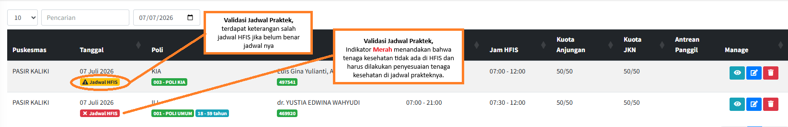

#### 2. [ FITUR PENAMBAHAN NAMA PASIEN DI TIKET ANTRIAN ]

Role: Anjungan

Fitur ini difungsikan untuk menampilkan nama pasien secara langsung di tiket antrian yang dicetak. Penambahan nama ini berlaku bagi pencetakan tiket untuk pasien lama (Umum/BPJS) serta pasien Mobile JKN yang melakukan check-in melalui mesin anjungan. Hal ini bertujuan untuk memberikan kepastian kepada pasien bahwa tiket yang dicetak benar-benar atas nama mereka.

Gambar Tampilan Penambahan Nama di Tiket Antrian:

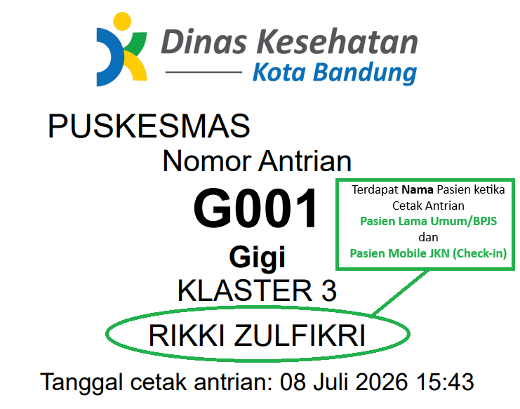

#### 3. [ FITUR EDIT DATA PASIEN OLEH ADMIN ]

Role: Admin

Fitur ini difungsikan untuk memudahkan admin puskesmas dalam mengubah atau memperbaiki data pasien secara langsung melalui dashboard antrian. Dengan adanya fitur ini, jika terdapat kesalahan data identitas, perbaikan dapat langsung dilakukan tanpa harus membatalkan antrian. Fitur ini sangat bermanfaat untuk memastikan data BPJS dan profil pasien akurat sebelum dilayani di poli.

Gambar Letak Tombol Edit Pasien:

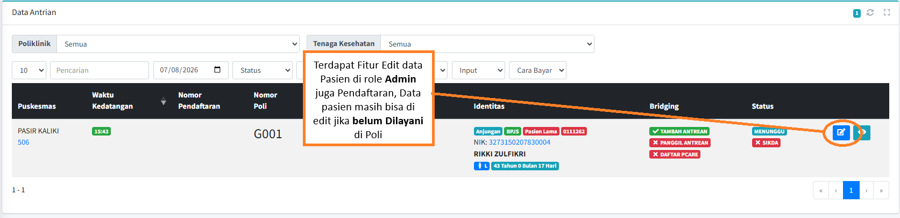

Gambar Form Edit Data Pasien:

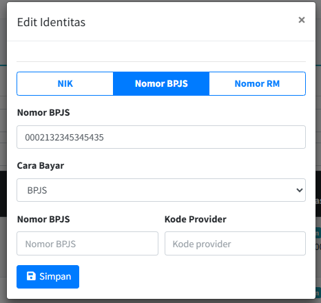

### [ UPDATED: 29 Mei 2026 ]

Version: 2.5.2

---

#### 1. [ FITUR CHECK-IN TIDAK MERUBAH NO. ANTRIAN MOBILE JKN ]

Role: Anjungan | Admin

Fitur Check-in dengan no. antrian tetap sesuai mJKN baik antrian terlewat ataupun tidak, kecuali berganti poli.

Pilih di pengaturan untuk mengaktifkan nya.

Gambar Pengaktifan Fitur No. Antrian Tetap
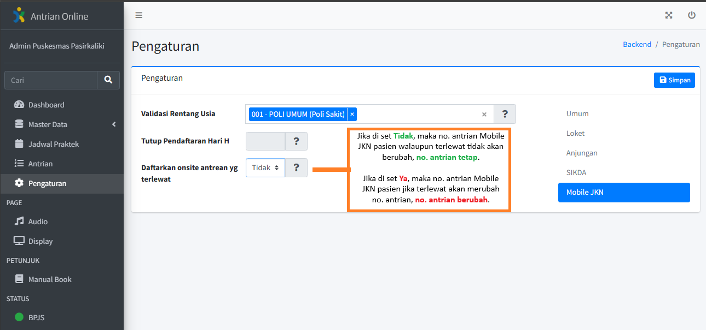

Gambar Tampilan Fitur Cetak Antrian Aktif ketika check-in pasien mobile jkn di anjungan

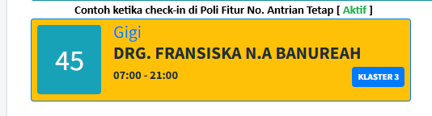

Gambar Tampilan Fitur Cetak Antrian Tidak Aktif ketika check-in pasien mobile jkn di anjungan

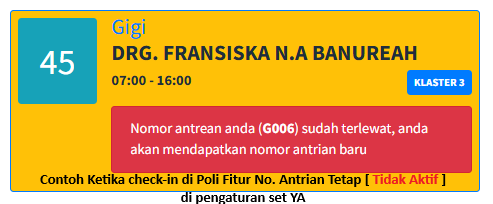

### [ UPDATED: 20 Mei 2026 ]

Version: 2.3.2

---

#### 1. [ Fitur Batas Jam Pendaftaran Pasien di Mobile JKN ]

Role: Admin

Fitur yang difungsikan untuk membatasi jam pendaftaran pasien di mobile jkn.
Untuk pengaturan nya masuka ke bagian Pengaturan -> Tab Mobile JKN lanjut tentukan jam batas pendaftaran nya.

Gambar Pengaturan set Batas Pendaftaran di Mobile JKN.

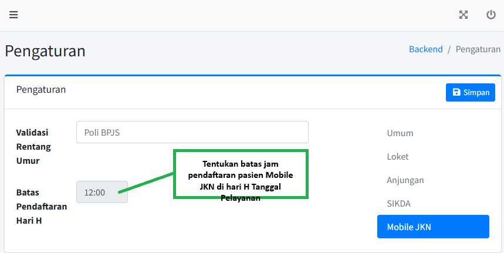

### [ UPDATED: 12 Mei 2026 ]

Version: 2.3.1

---

#### 1. [ Fitur Validasi Rentang Usia Mobile JKN ]

Role: Admin

Fitur yang difungsikan untuk meminimalisir kesalahan pemilihan poli atau dokter, ketika satu poli bpjs mempunyai beberapa poli atau dokter, sehingga walaupun pasien memilih dokter yang salah, sistem akan mem validasi dari usia pasien untuk pemilihan dokter nya.

Untuk pengaturan nya masuka ke bagian Master Data -> Poliklinik -> Edit kemudia pilih poli yang akan di set rentang umurnya, lanjut set pilihan menu Rentang Umur, aktifkan dan atur rentang umur nya, begitu juga ketika di poli yang sama lainnya.

Gambar Pengaturan set Rentang Umur di Poli.

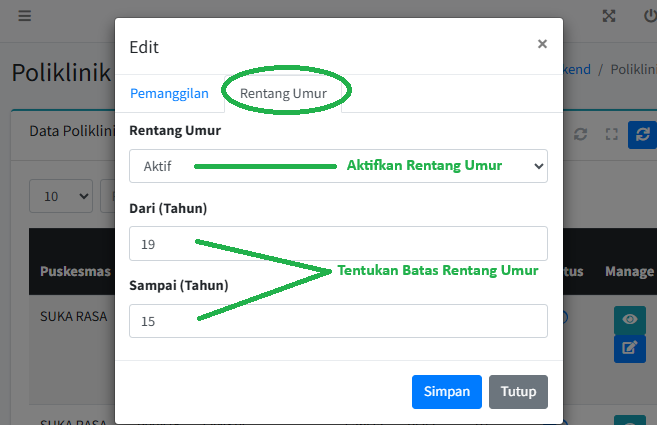

Selanjutnya masuk ke Pengaturan pilih tab Mobile JKN dan aktifkan Poli BPJS yang akan di aktifkan fitur rentang umurnya.

Gambar set aktivasi poli bpjs fitur rentang umur.

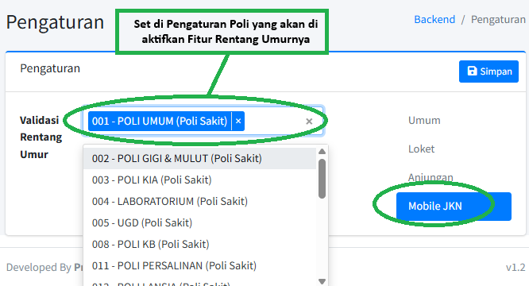

Di Jadwal Praktek ditampilkan Keterangan Poli, rentang umur dan kode dokter BPJS.

Gambar Keterangan Poli, rentang umur dan kode dokter BPJS tampil di jadwal praktek.

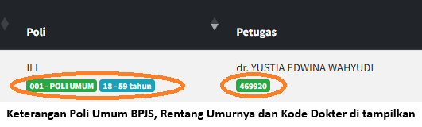

### [ UPDATED: 21 April 2026 ]

Version: 2.2.3

---

#### 1. [ Fitur Check-In Pasien Mobile JKN di Anjungan ]

Role: Anjungan

Fitur yang difungsikan untuk memantau pasien sudah hadir di puskesmas atau belum, jika belum check-in maka belum datang pasien tersebut, untuk check-in pasien tinggal menginputkan no. bpjs ke anjungan, dan jika di perlukan pasien Mobile JKN bisa mencetak tiket antrian yang nomor nya sama ketika mendaftar di mobile jkn, tetapi jika pasien salah mendaftar poli maka pasien diarahkan untuk memilih poli yang sesuai namun antrian nya akan mengikuti antrian poli yang di pilih.

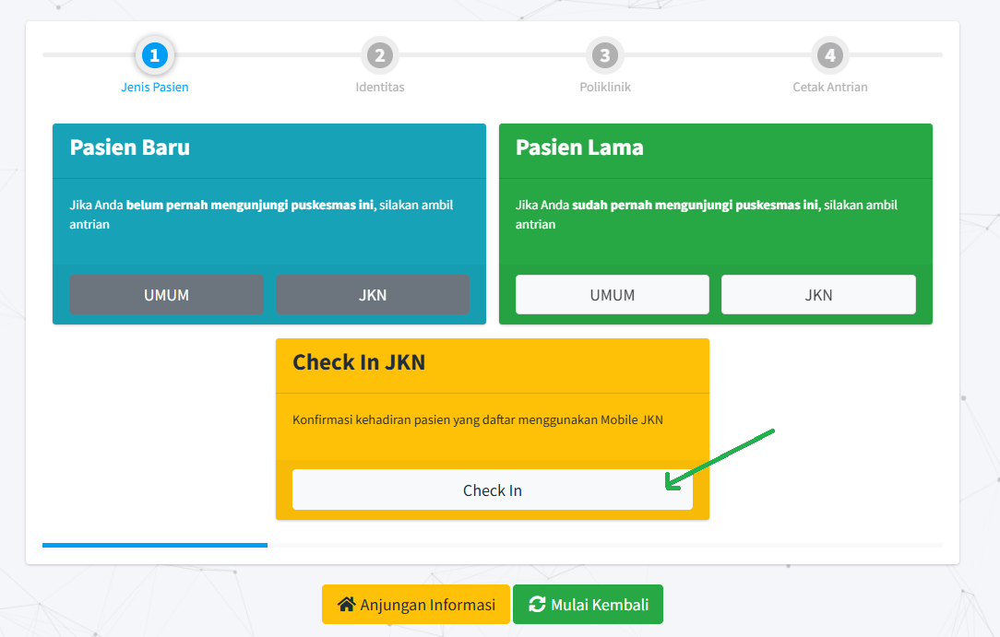
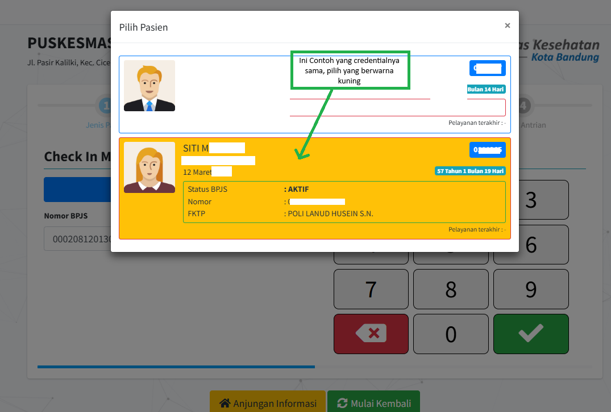
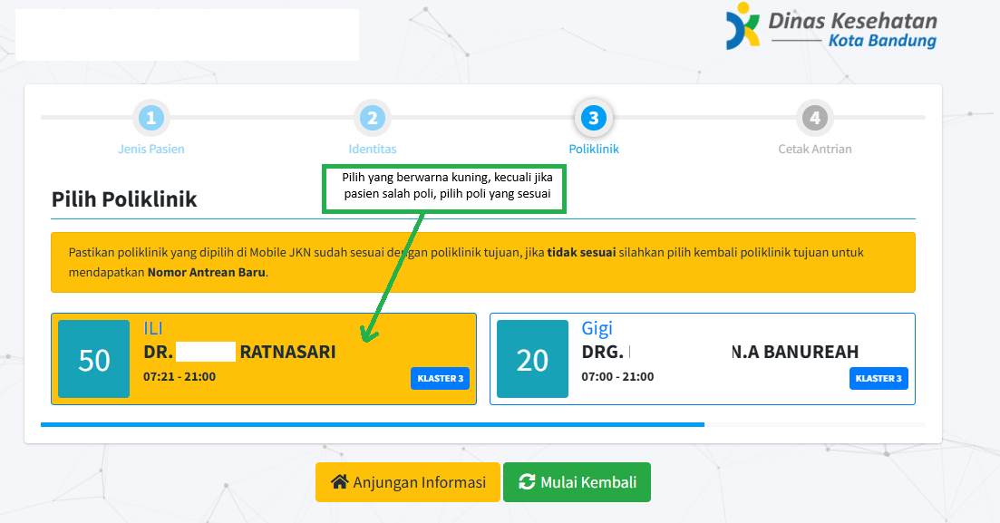
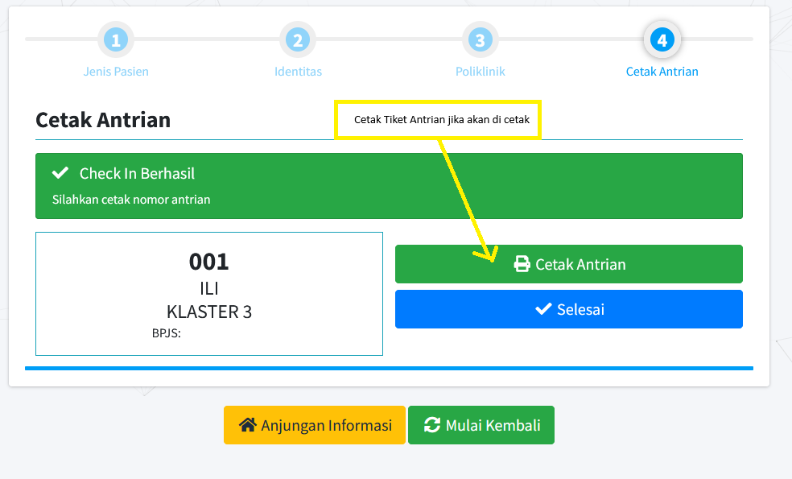

> Jika Pasien Mobile JKN terlewat nomor antrian nya, maka nomor antrian nya akan menyesuaikan dengan nomor antrian yang terakhir di ambil oleh pasien lain.

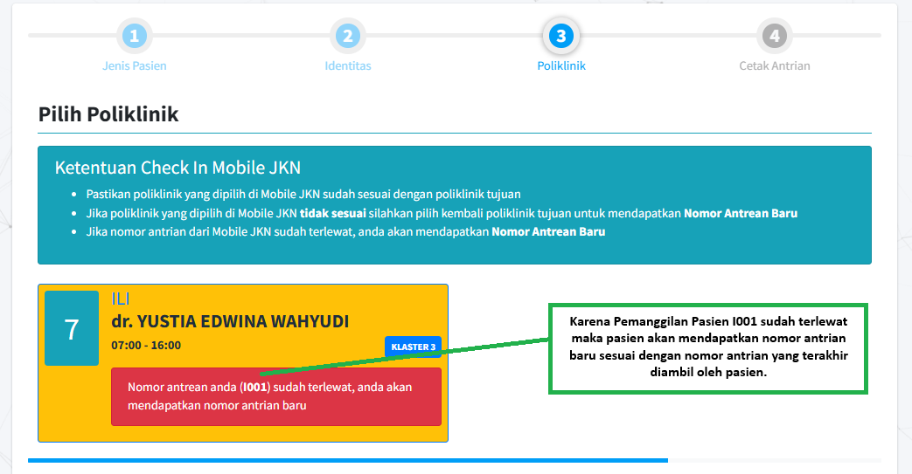

#### 2. [ Status Check-in di Poli ]

Role: Poli

Status keterangan pasien Mobile JKN bisa terlihat di menu Poli pada kolom Nomor Poli,

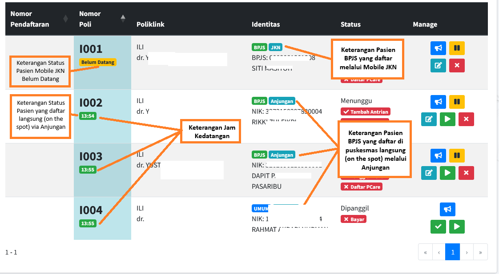

#### 3. [ Keterangan Icon Status Antrian Poli ]

Role: Poli

Terdapat Icon Status Antrian tambahan di Poli yaitu, Kuota JKN (Mobile JKN), Kuota Anjungan, dan Antrian Terakhir yang dilayani.

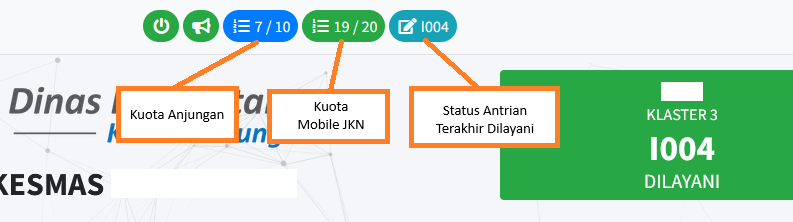

### [ UPDATED: 08 April 2026 ]

Version: 2.1.4

---

#### 1. [ Pengecekan Status Antrian ]

Role: Admin

Pengecekan Status Antrian bisa di pantau di akun admin antrian dinkes pada menu "Antrian".

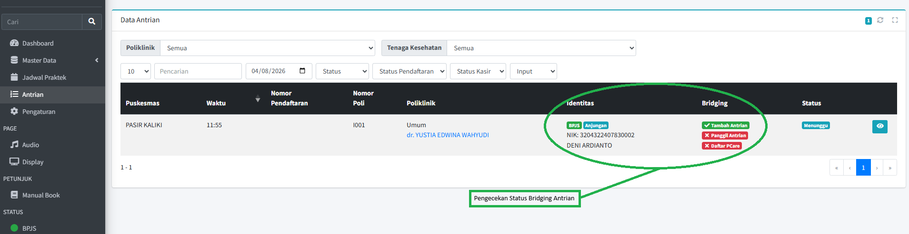

#### 2. [ Kuota ANjungan dan Kuota JKN (Mobile JKN) ]

Kuota pasien di pisah menjadi Kuota Anjungan dan Kuota JKN (Mobile JKN)

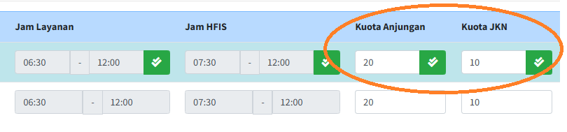

#### 3. [ Edit Jadwal ]

Role: Admin

Penambahan fitur edit jadwal praktek dokter di akun admin puskesmas

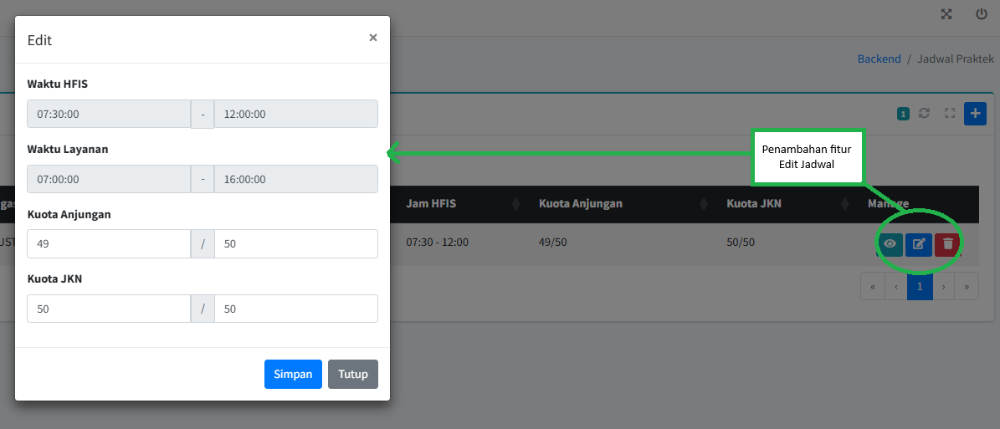

#### 4. [ Validasi Skrining ]

Role: Anjungan

Adanya Validasi pasien yang belum skrining untuk pasien yang mengambil antrian poli ketika di puskesmas, ada keterangan pasien belum skrining di tiket antrian jika pasien belum melakukan skrining, kemudian ada tombol pindai skrining untuk melakukan skrining.

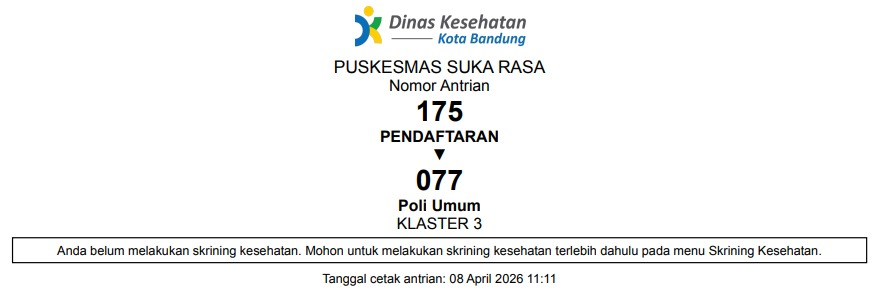
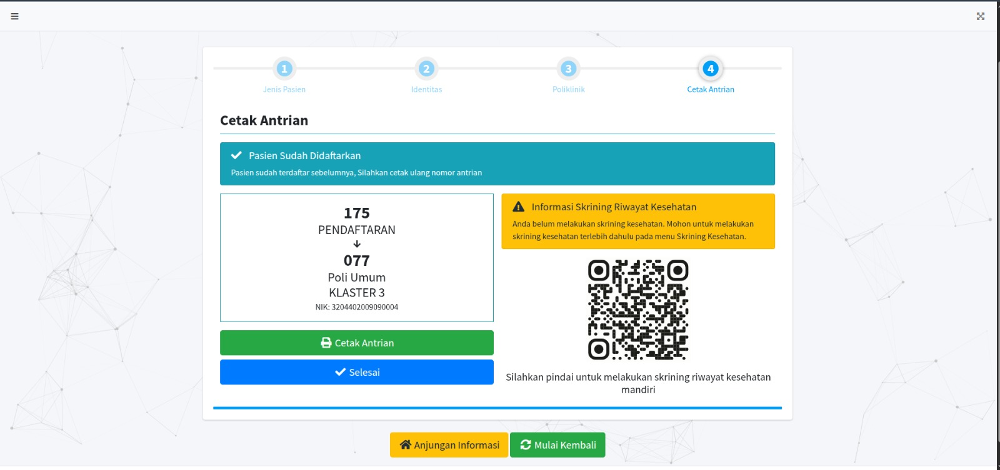

---

## Apa yang Harus Dilakukan Tindak Lanjut oleh Puskesmas?

1. **Update Jadwal Praktek**: Pastikan Admin Puskesmas mengisi jadwal praktek dokter di akun admin antrian dinkes di setiap tanggal pelayanan.

2. **Update Jadwal HFIS**: Pastikan Admin Puskesmas mengisi jadwal HFIS sesuai dengan jadwal praktek dokter di akun admin antrian dinkes.

3. **Selesaikan Status Antrian**: Pastikan Admin Puskesmas menyelesaikan status antrian pasien di akun admin atau poli di sistem antrian dinkes.

4. **Cakupan Antrian BPJS**: Pastikan untuk status di pcare dari setiap pasien adalah _**Bridging Antrian**_ / Bridging MJKN, karena perhitungan cakupan bpjs akan dihitung berdasarkan status tersebut.

---

<!-- > **Referensi Resmi**: Anda dapat merujuk ke portal **Web Service BPJS Kesehatan (Trustmark)** untuk informasi spesifikasi teknis API selengkapnya. -->
