# [HOME](README.md)
# CHANGELOG | PEMBARUAN APLIKASI ANTRIAN DINKES

<!--  -->

## 1.1.3 - 08-01-26

Version: 1.1.3 |
Tanggal: 08 Januari 2025

### CHANGED
---
#### [ AKUN ADMIN PUSKESMAS ]
- [ PENGATURAN PASIEN BPJS ] -> Pasien BPJS hanya dapat mendaftar pada FKTP yang sesuai dengan data BPJSnya.
  
Pilih di pengaturan untuk memilih kondisi 

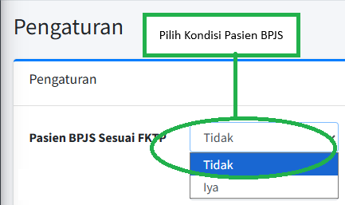

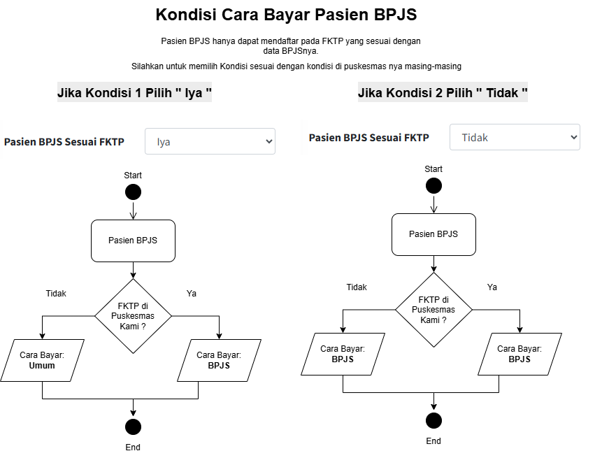

- [ PENGATURAN PASIEN IMUNISASI ] -> Pendaftaran KIA Imunisasi akan dijadikan gratis untuk semua pasien
  
Pilih di pengaturan untuk memilih kondisi 

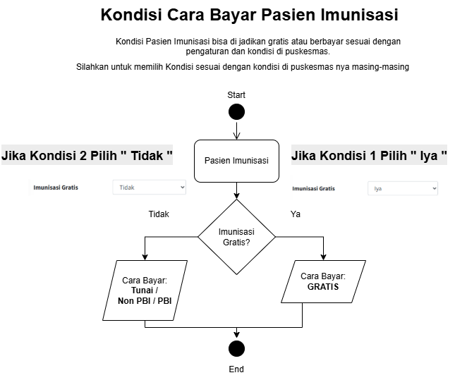
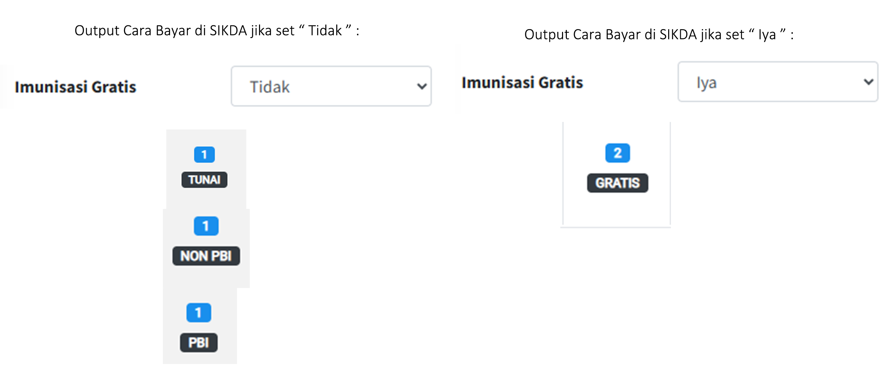

- [ SUARA PEMANGGILAN PASIEN DI POLI ] -> Pemanggilan pasien di poli bisa sesuaikan sesuai dengan preferensi di puskesmas.
  
Pilih di pengaturan untuk setting nama pemanggilan

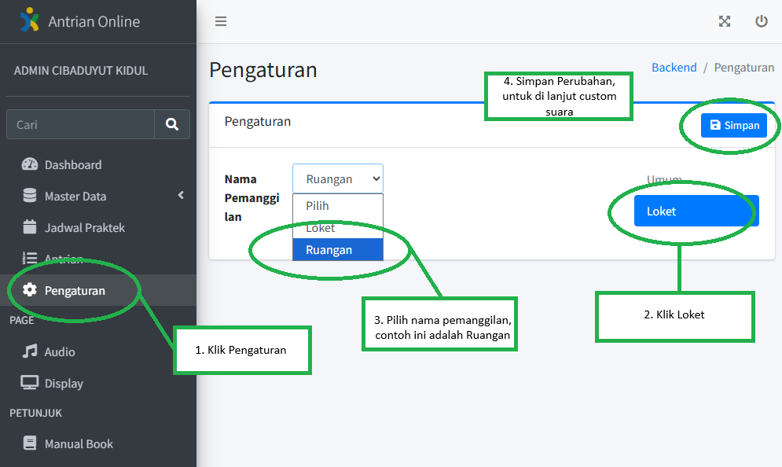

Di bagian Poliklinik pilih Edit untuk mengatur custom suara per poli

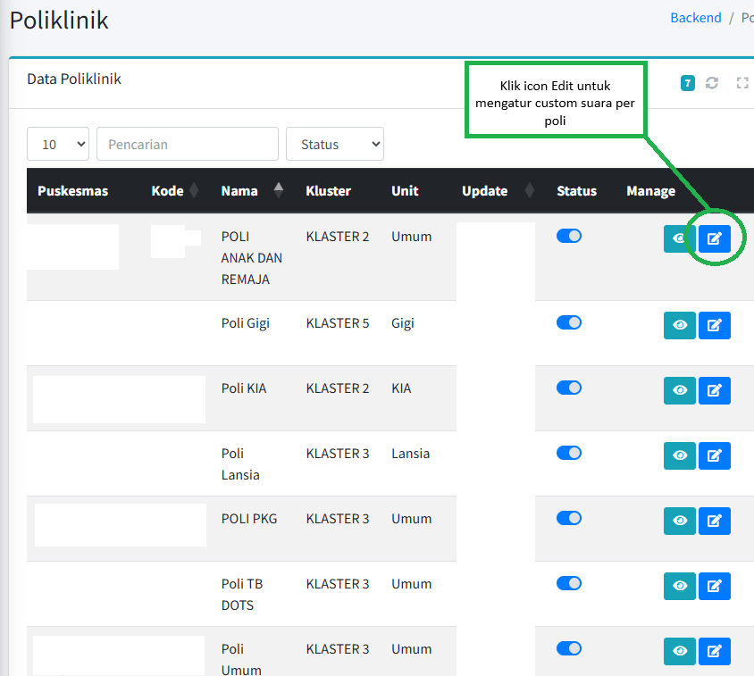

Akan muncul Popup dan klik Text to Sound untuk membuat custom sound

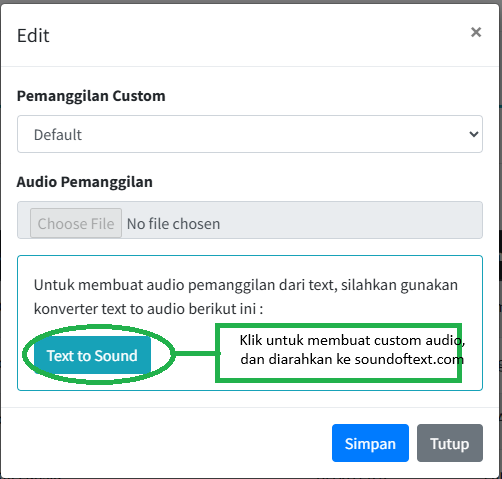

Buat custom text sendiri di soundoftext.com

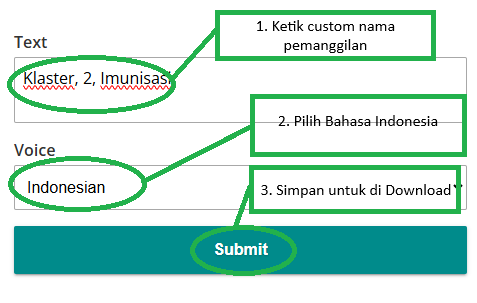

Download untuk disimpan di komputer yang nantinya akan di upload di pengaturan antrian dinkes

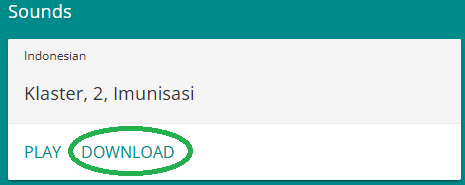

Kembali ke Pengaturan Antrian Dinkes pilih custom

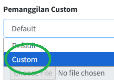

Di bagian Audio Pemanggilan pilih file yang sudah di download dari sounoftext.com dan pilih file audio nya untuk di upload.

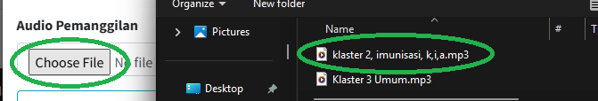

Kemudia klik tombol Simpan jika sudah selesai.

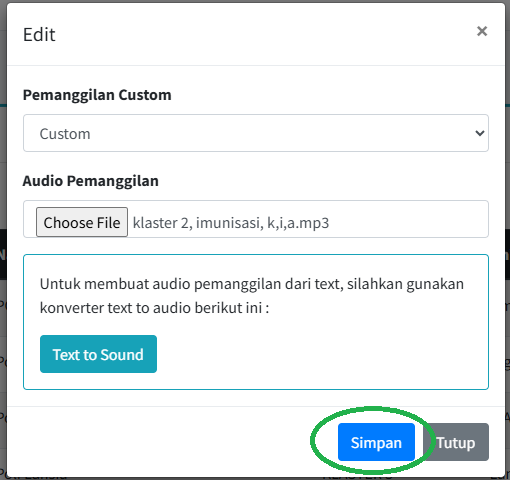

Jika sudah di set maka suara pemanggilan akan ada penambahan custom suara seperti yang sudah di set.

#### [ AKUN POLI PUSKESMAS ]

- [ FILTERING POLI DAN NAKES ] -> Di akun user poli bisa juga memanggil pasien di poli lain, sehingga satu user poli bisa digunakan untuk banyak poli.

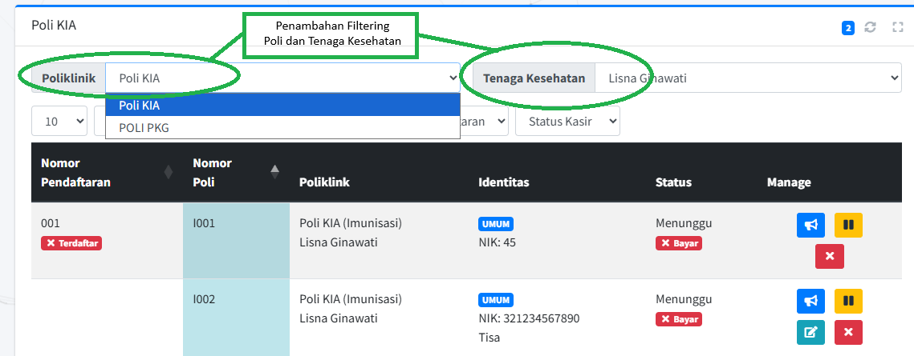

---

## 1.1.2 - 15-12-25

Version: 1.1.2 |
Tanggal: 15 Desember 2025

### CHANGED
---
#### [ AKUN ADMIN PUSKESMAS ]
- [ AKSES PUBLIK BISA LANGSUNG ONLINE TANPA SERVER LOCAL YANG DI INSTALL DI PUSKESMAS ] -> Jika menggunakan [__Link Akses Aplikasi - Akses Publik__](README.md#link-akses-aplikasi) dan mengosongkan ip pada bagian edit puskesmas maka akan secara default akan menembak server yang berada di dinkes, sehingga tidak perlu lagi untuk install / set / menjalankan server antrian secara local di puskesmas.
  

Secara default jika tidak menggunakan server antrian local di puskesmas maka akan langsung online.

---

## 1.1.1 - 10-12-25

Version: 1.1.1 |
Tanggal: 10 Desember 2025

### ADDED
---

#### [ AKUN ADMIN PUSKESMAS ]
- [ AKUN ADMIN ] -> Suara Pemanggilan antrian di bagian Poli bisa di rubah menjadi "Ruangan".
  

- [ AKUN ADMIN ] -> Jika ip server tidak di set di bagian admin puskesmas, maka secara default akan terhubung dengan server yang berada di Dinas.
  

- [ AKUN ADMIN ] [ MODE BRIDGING SIKDA PASIEN UMUM ] -> Terdapat 2 Mode Bridging SIKDA, silahkan disesuaikan dengan kondisi alur di puskesmas masing-masing.
  

#### [ AKUN PENDAFTARAN PUSKESMAS ]
- [ AKUN PENDAFTARAN ] -> Terdapat penambahan tombol skip dan batal di akun loket pendaftaran.
  

#### [ AKUN ANJUNGAN PUSKESMAS ]
- [ AKUN ANJUNGAN ] -> Terdapat keterangan usia di popup verifikasi bagian kanan bawah.
  

### CHANGED
---
#### [ AKUN ANJUNGAN ]
- [ AKUN ANJUNGAN ] -> Cara bayar pasien sesuai dengan kondisi saat cetak antrian, jika pasien umum maka data cara bayar nya akan tunai, jika pasien jkn maka cara bayar nya akan jkn.
  

#### [ AKUN PENDAFTARAN ]
- [ AKUN PENDAFTARAN ] -> Dibagian pasien Ketika klik Selesai akan muncul verifikasi pasien yang tadinya BPJS/Gratis menjadi di pisah Gratis dan BPSJ, kemudian ada keterangan usia pasien tersebut. 
  

---

## 1.1.0 - 15-09-25

Version: 1.1.0 |
Tanggal: 15 September 2025

### ADDED
---
#### [ AKUN ADMIN PUSKESMAS ]
- [ AKUN ADMIN PUSKESMAS ] -> Tampilan jadwal praktek BPJS ditampilkan di bagian tambah jadwal, sehingga menjadi panduan untuk menambahkan jadwal di aplikasi antrian dinkes.
  

#### [ AKUN PENDAFTARAN ]
- Penambahan tombol Gratis/BPJS ketika menekan tombol selesai pendaftaran .
  

#### [ AKUN KASIR ]
- Penambahan tombol Gratis/BPJS ketika menekan tombol selesai Pembayaran .
  

#### [ AKUN POLI ]
- [ AKUN POLI ] -> terdapat filtering data pasien yang mengantri di tenaga kesehatan tertentu, sehingga memudahkan untuk filtering pemanggilan ke poli.
  

### CHANGED
---
#### [ AKUN PENDAFTARAN ]
- [ AKUN PENDAFTARAN ] -> Editing NIK di bagian Pendaftaran ( bagi yang sudah cetak antrian pasien baru di anjungan ), memungkinkan dilakukan peng-editan di pendaftaran.
  

---