# [HOME](README.md)
# CHANGELOG | PEMBARUAN APLIKASI ANTRIAN DINKES

<!--  -->

## 1.1.2 - 15-12-25

Version: 1.1.2 |
Tanggal: 15 Desember 2025

### CHANGED
---
#### [ AKUN ADMIN PUSKESMAS ]
- [ AKSES PUBLIK BISA LANGSUNG ONLINE TANPA SERVER LOCAL YANG DI INSTALL DI PUSKESMAS ] -> Jika menggunakan [__Link Akses Aplikasi - Akses Publik__](README.md#link-akses-aplikasi) dan mengosongkan ip pada bagian edit puskesmas maka akan secara default akan menembak server yang berada di dinkes, sehingga tidak perlu lagi untuk install / set / menjalankan server antrian secara local di puskesmas.
  
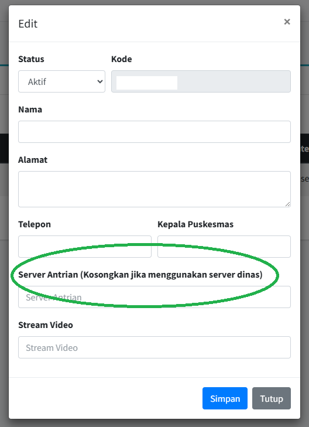

Secara default jika tidak menggunakan server antrian local di puskesmas maka akan langsung online.

---

## 1.1.1 - 10-12-25

Version: 1.1.1 |
Tanggal: 10 Desember 2025

### ADDED
---

#### [ AKUN ADMIN PUSKESMAS ]
- [ AKUN ADMIN ] -> Suara Pemanggilan antrian di bagian Poli bisa di rubah menjadi "Ruangan".
  
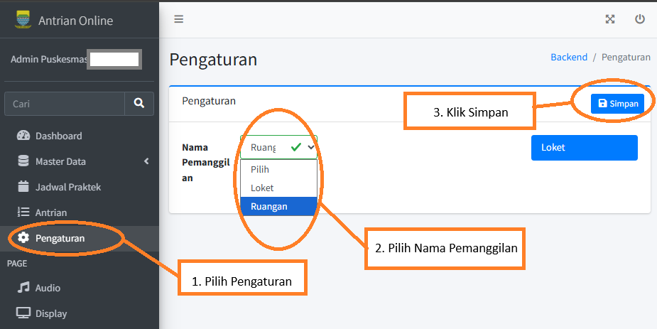

- [ AKUN ADMIN ] -> Jika ip server tidak di set di bagian admin puskesmas, maka secara default akan terhubung dengan server yang berada di Dinas.
  
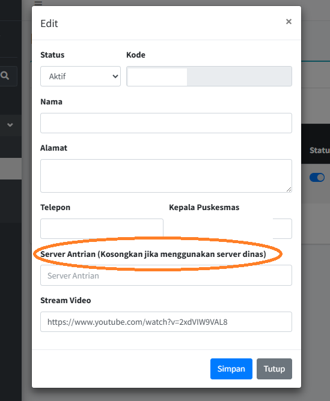

- [ AKUN ADMIN ] [ MODE BRIDGING SIKDA PASIEN UMUM ] -> Terdapat 2 Mode Bridging SIKDA, silahkan disesuaikan dengan kondisi alur di puskesmas masing-masing.
  
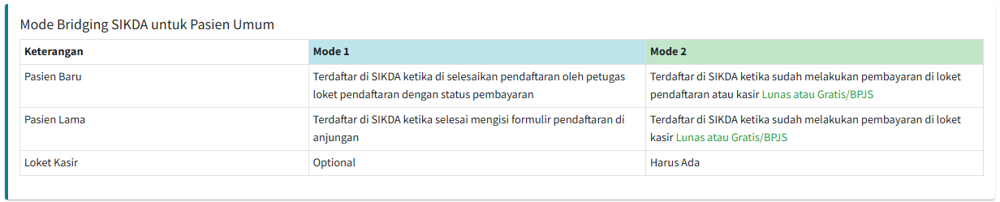
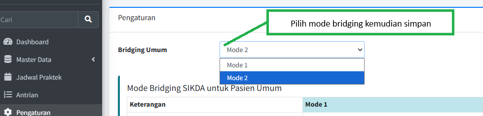

#### [ AKUN PENDAFTARAN PUSKESMAS ]
- [ AKUN PENDAFTARAN ] -> Terdapat penambahan tombol skip dan batal di akun loket pendaftaran.
  
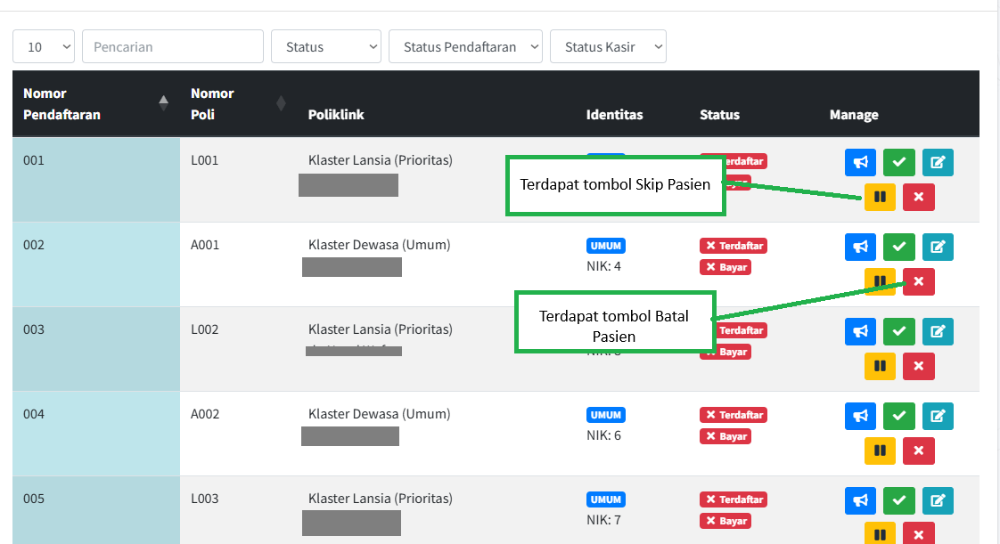

#### [ AKUN ANJUNGAN PUSKESMAS ]
- [ AKUN ANJUNGAN ] -> Terdapat keterangan usia di popup verifikasi bagian kanan bawah.
  
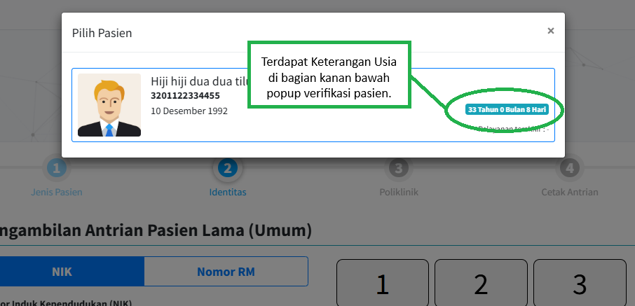

### CHANGED
---
#### [ AKUN ANJUNGAN ]
- [ AKUN ANJUNGAN ] -> Cara bayar pasien sesuai dengan kondisi saat cetak antrian, jika pasien umum maka data cara bayar nya akan tunai, jika pasien jkn maka cara bayar nya akan jkn.
  
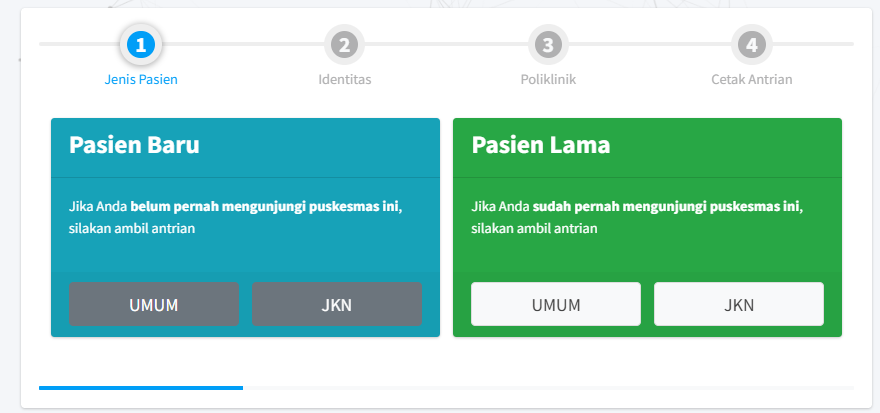

#### [ AKUN PENDAFTARAN ]
- [ AKUN PENDAFTARAN ] -> Dibagian pasien Ketika klik Selesai akan muncul verifikasi pasien yang tadinya BPJS/Gratis menjadi di pisah Gratis dan BPSJ, kemudian ada keterangan usia pasien tersebut. 
  
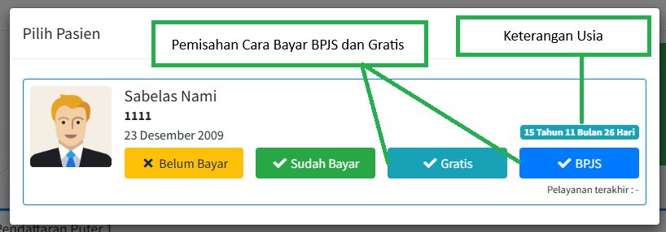

---

## 1.1.0 - 15-09-25

Version: 1.1.0 |
Tanggal: 15 September 2025

### ADDED
---
#### [ AKUN ADMIN PUSKESMAS ]
- [ AKUN ADMIN PUSKESMAS ] -> Tampilan jadwal praktek BPJS ditampilkan di bagian tambah jadwal, sehingga menjadi panduan untuk menambahkan jadwal di aplikasi antrian dinkes.
  
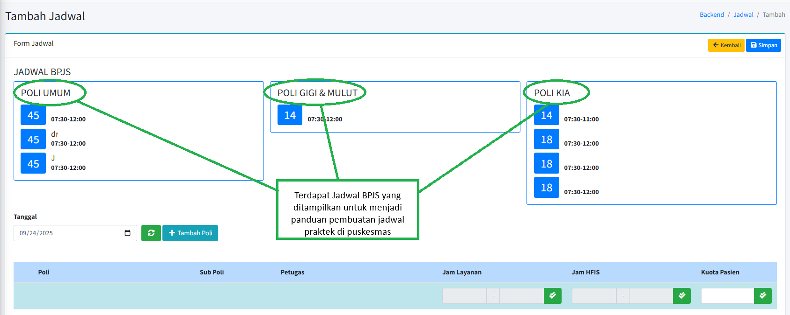

#### [ AKUN PENDAFTARAN ]
- Penambahan tombol Gratis/BPJS ketika menekan tombol selesai pendaftaran .
  
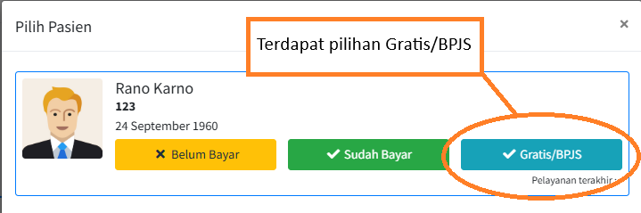

#### [ AKUN KASIR ]
- Penambahan tombol Gratis/BPJS ketika menekan tombol selesai Pembayaran .
  
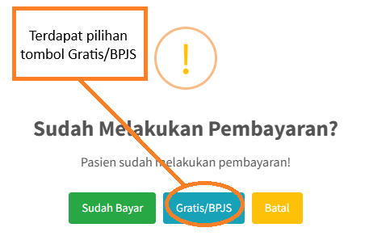

#### [ AKUN POLI ]
- [ AKUN POLI ] -> terdapat filtering data pasien yang mengantri di tenaga kesehatan tertentu, sehingga memudahkan untuk filtering pemanggilan ke poli.
  

### CHANGED
---
#### [ AKUN PENDAFTARAN ]
- [ AKUN PENDAFTARAN ] -> Editing NIK di bagian Pendaftaran ( bagi yang sudah cetak antrian pasien baru di anjungan ), memungkinkan dilakukan peng-editan di pendaftaran.
  

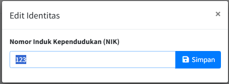

---