# DOKUMENTASI APLIKASI ANTRIAN DINKES KOTA BANDUNG

# PENDAHULUAN

## Gambaran Umum Aplikasi dan Manfaatnya

Aplikasi Antrian Puskesmas Dinkes Kota Bandung adalah solusi digital yang dirancang untuk mempermudah proses pelayanan kesehatan di puskesmas. Aplikasi ini menyederhanakan alur antrian pasien, pendaftaran, pembayaran, hingga pelayanan poli, sehingga mengurangi
waktu tunggu dan meningkatkan efisiensi bagi pasien maupun petugas.

### Use Case Diagram Aplikasi

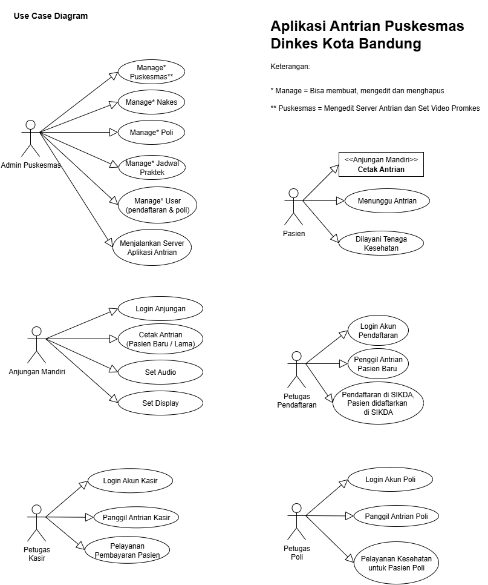

### Flow Diagram Aplikasi

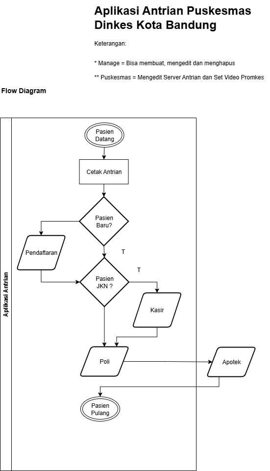

### Swimlane Diagram Aplikasi

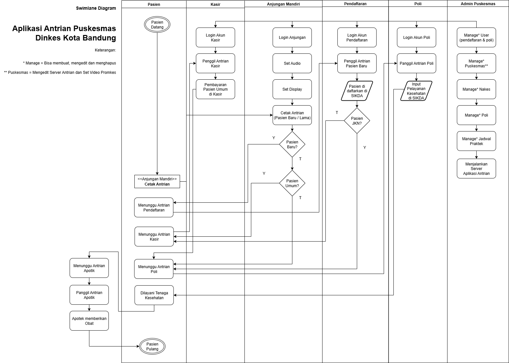

### Fitur Utama

<!-- <iframe width="560" height="615" src="https://www.youtube.com/embed/6i0AA0cDTW4?si=CaQdguL0K2ztTxl6" title="YouTube video player" frameborder="0" allow="accelerometer; autoplay; clipboard-write; encrypted-media; gyroscope; picture-in-picture; web-share" referrerpolicy="strict-origin-when-cross-origin" allowfullscreen></iframe> -->

1)  Anjungan Mandiri

    a.  Pasien dapat mencetak nomor antrian secara mandiri berdasarkan jenis layanan (baru/lama, poli, atau kasir).

    b.  Dilengkapi pengaturan audio dan display untuk aksesibilitas.

2)  Manajemen Antrian Terintegrasi

    a.  Antrian terpusat untuk pendaftaran, poli, kasir, dan apotek.

    b.  Pemanggilan antrian digital oleh petugas secara real-time.

3)  Dukungan Multi-Role

    a.  Petugas Pendaftaran: Input data pasien baru/lama ke sistem SIKDA.

    b.  Petugas Poli: Mencatat pelayanan kesehatan langsung di sistem.

    c.  Petugas Kasir/Apotek: Proses pembayaran dan pengambilan obat terautomasi.

    d.  Admin Puskesmas: Kelola data tenaga kesehatan, jadwal, dan konfigurasi server.

4)  Integrasi dengan SIKDA

    a.  Data pasien tersinkronisasi dengan Sistem Informasi Kesehatan Daerah (SIKDA) untuk akurasi rekam medis.

### Manfaat Aplikasi

1)  Bagi Pasien

    a.  Lebih Cepat: Tidak perlu antri manual sejak awal.

    b.  Transparan: Nomor antrian dan status layanan dapat dipantau.

    c.  Fleksibel: Mendukung pasien JKN (BPJS) dan umum.

2)  Bagi Petugas Puskesmas

    a.  Efisiensi Waktu: Kurangi beban administrasi dengan sistem terdigitalisasi.

    b.  Minim Kesalahan: Data pasien tercatat otomatis dan terintegrasi.

> Dengan aplikasi ini, pelayanan kesehatan puskesmas menjadi lebih tertata, cepat, dan ramah pengguna.

## Daftar Pengguna (Role) dan Fungsinya

Aplikasi Antrian Puskesmas Dinkes Kota Bandung digunakan oleh berbagai peran (role) dengan fungsi yang berbeda-beda. Berikut penjelasan lengkapnya:

### Admin Puskesmas

-   Fungsi:

    -   Login ke dashboard admin untuk mengelola sistem.

    -   Manajemen Pengguna:Membuat, mengedit, atau menghapus akun petugas (pendaftaran, poli, kasir).

    -   Manajemen Layanan:Mengatur data tenaga kesehatan (nakes), poli, dan jadwal praktik.

    -   Konfigurasi Sistem: Mengatur server antrian dan konten promosi kesehatan (video promkes).

-   Hak Akses:

    -   Akses penuh ke semua fitur administrasi.

    -   Monitoring seluruh aktivitas antrian.

### Pasien

-   Fungsi:

    -   Mencetak nomor antrian secara mandiri melalui Anjungan Mandiri.

    -   Memilih jenis layanan (pasien baru/lama, poli, atau pembayaran).

    -   Menunggu pemanggilan antrian sesuai kebutuhan (pendaftaran, poli, kasir, atau apotek).

    -   Mendapatkan pelayanan kesehatan setelah dipanggil oleh petugas.

-   Hak Akses:

    -   Menggunakan Anjungan Mandiri untuk mengambil antrian.

    -   Melihat informasi antrian dan status layanan.

### Petugas Pendaftaran

-   Fungsi:

    -   Login ke sistem menggunakan akun pendaftaran.

    -   Memanggil antrian pasien baru/lama.

    -   Melakukan pendaftaran pasien dan memasukkan data ke Sistem Informasi Kesehatan Daerah (SIKDA).

    -   Memverifikasi kepesertaan JKN (BPJS Kesehatan) jika diperlukan.

    -   Mengarahkan pasien ke poli atau kasir sesuai kebutuhan.

-   Hak Akses:

    -   Akses ke modul pendaftaran pasien.

    -   Input dan edit data pasien di SIKDA.

### Petugas Poli

-   Fungsi:

    -   Login ke sistem menggunakan akun poli.

    -   Memanggil antrian pasien yang menunggu di poli.

    -   Mencatat hasil pemeriksaan atau pelayanan kesehatan di SIKDA.

    -   Mengarahkan pasien ke apotek jika memerlukan obat.

-   Hak Akses:

    -   Akses ke modul list pasien yang akan melakukan pelayanan poli.

    -   Input data rekam medis pasien di SIKDA.

### Petugas Kasir

-   Fungsi:

    -   Login ke sistem menggunakan akun kasir.

    -   Memanggil antrian pasien yang membutuhkan pembayaran.

    -   Melakukan proses pembayaran (untuk pasien umum).

-   Hak Akses:

    -   Akses ke list pasien yang akan melakukan pembayaran (kasir).

Pentingnya Peran Masing-Masing Pengguna, setiap role memiliki tanggung jawab yang saling terkait untuk memastikan pelayanan kesehatan berjalan lancar. 
>Dengan pembagian tugas yang jelas, aplikasi ini membantu mengurangi antrian manual, meminimalkan kesalahan data, dan meningkatkan efisiensi waktu bagi pasien dan petugas.

# PANDUAN ADMIN PUSKESMAS

Ada beberapa langkah yang harus di set oleh admin puskesmas untuk kebutuhan memulai aplikasi antrian ini, berikut urutan langkah yang harus di set oleh admin puskesmas.

## Tahapan Pengaturan Aplikasi oleh Admin Puskesmas

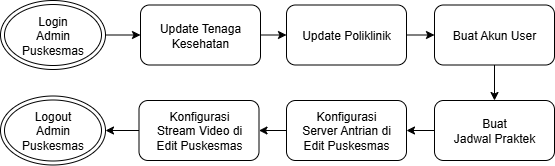

## Peta Pelayanan 
Selanjutnya disarankan untuk membuat Peta Pelayanan terlebih dahulu untuk memudahkan visualisasi titk layanan di Puskesmas. Peta pelayanan puskesmas merupakan panduan visual / tekstual yang menampilkan ketersediaan layanan, lokasi layanan, dan peran petugas di Puskesmas.

Dibawah ini adalah contoh Peta Pelayanan dan dapat disesuaikan dengan puskesmas masing-masing.

Contoh Peta Pelayanan Puskesmas

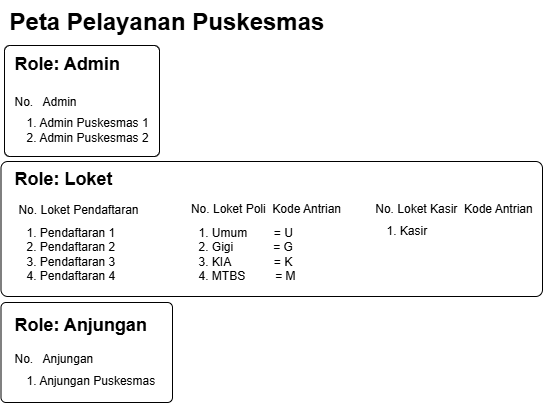

Jika sudah membuat Peta Layanan dan tergambar role dan pengguna nya maka Selanjutnya kita bisa memulai langkah-langkah Tahapan Pengaturan Aplikasi Antrian seperti yang ditujukan pada Gambar Tahapan Pengaturan.

## Login ke Dashboard Admin

Langkah-langkah:

1)  Buka aplikasi melalui browser.

2)  Masukkan Username dan Password admin puskesmas.

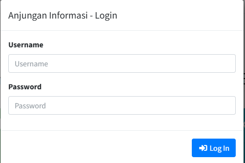

3)  Klik tombol \"Login\".

4)  Setelah berhasil, Anda akan masuk ke Dashboard Admin.

Dashboard Admin

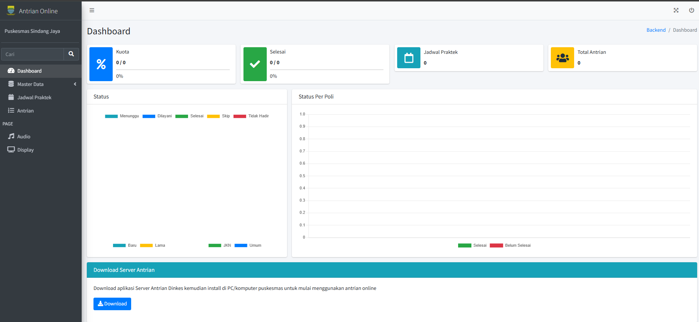

## Update Tenaga Kesehatan

Data Tenaga Kesehatan sudah terintegrasi dengan aplikasi SIKDA, sehingga untuk menambahkan tenaga kesehatan kita cukup untuk meng-update saja, ketika sudah di update maka data akan sesuai dengan data tenaga kesehatan di SIKDA, berikut cara update tenaga kesehatan.

Update Tenaga Kesehatan

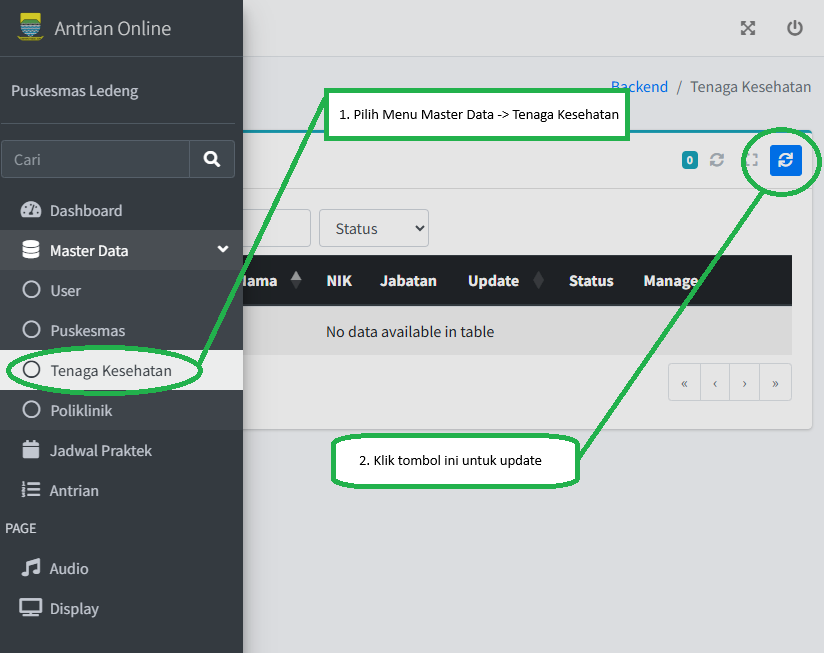

Fitur Data Tabel Nakes

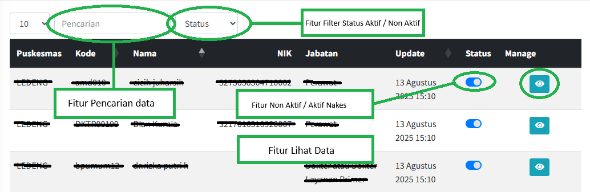

## Update Poliklinik

Untuk data Poliklinik sudah terintegrasi dengan SIKDA, sehingga untuk menambahkan data Poliklinik kita tinggal update saja, ketika sudah di update maka data akan sesuai dengan yang ada di SIKDA, berikut cara update Poliklinik.

Update Poliklinik

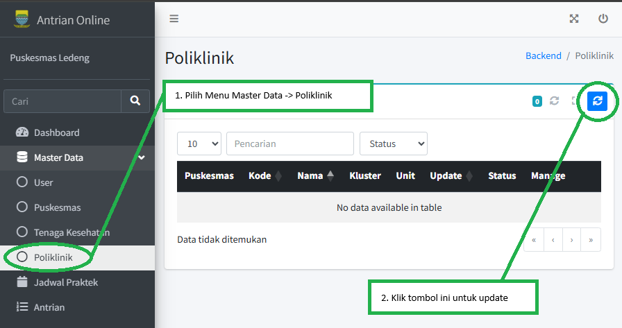

Fitur Data Tabel Poliklinik

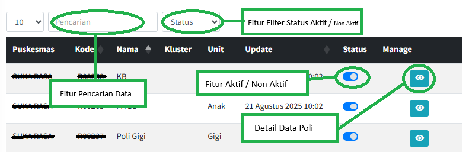

## Mengatur Akun User

Sebagai Admin Puskesmas, Anda memiliki kewenangan penuh untuk mengelola semua akun pengguna (user) dalam sistem aplikasi antrian. Akun-akun ini menentukan akses dan fungsi setiap petugas di puskesmas, seperti petugas pendaftaran, poli, kasir, dan anjungan. Pengelolaan akun yang baik memastikan bahwa hanya orang yang berwenang yang dapat mengakses sistem dan setiap tindakan dapat dilacak.

Sebagai Admin Puskesmas anda bisa Mengatur User untuk:

1)  Membuat akun pengguna baru.

2)  Melihat daftar semua pengguna yang terdaftar.

3)  Mengedit data pengguna yang sudah ada (misalnya, mengganti password
    atau role).

4)  Menonaktifkan atau Menghapus akun yang sudah tidak digunakan.

Ketika kita akan membuat / mengatur User maka Peta Pelayanan yang sudah dibuat memudahkan kita untuk me-meta-kan kita dalam pembuatan user seperti di Gambar 2.2. Contoh Peta Pelayanan Puskesmas, silahkan buat user sesuai dengan peta pelayanan yang sudah dibuat, berikut cara menambahkan akun user.

Gambar 2.9 Tambah Akun User

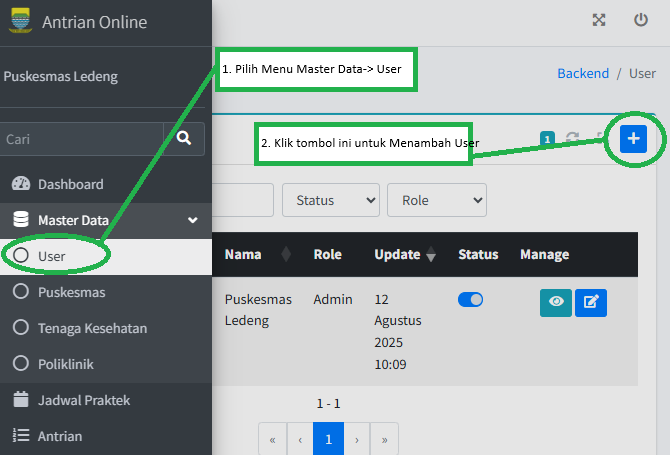

### Tambah Akun User Admin

Ketika menambahkan akun user admin akan ada pengisian form, berikut form isian yang bisa di isi ditunjukan dengan lingkaran oval hijau.

Gambar 2. 10 Form Tambah Akun User Admin

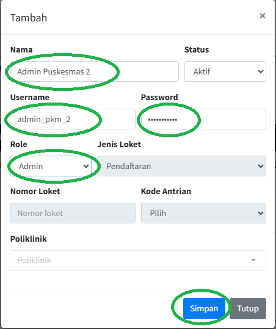

### Tambah Akun User Loket

Untuk menambahkan akun user loket fokuskan ke bagian role di form, pilih role nya adalah Loket.

Gambar 2. 11 Role Akun Loket

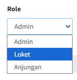

#### Akun User Loket Pendaftaran

Untuk Loket Pendaftaran yang perlu di isi adalah bagian yang diberi tanda oval hijau, sedangkan yang tanda oval merah tidak di isi.

Gambar 2. 12 Form Tambah Akun Loket
Pendaftaran

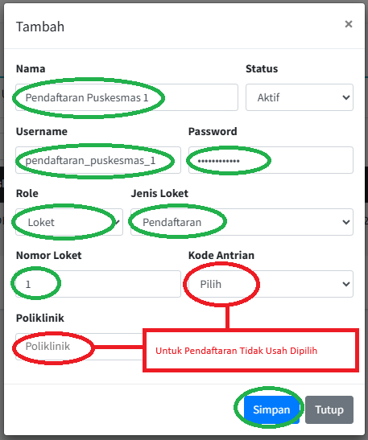

#### Akun User Loket Kasir

Untuk Loket Kasir yang perlu di isi adalah bagian yang diberi tanda oval hijau, sedangkan yang tanda oval merah tidak di isi.

Gambar 2. 13 Form Tambah Akun Loket Kasir

#### Akun User Loket Poliklinik

Untuk akun user loket Poliklinik semua isian harus di isi dan disesuaikan dengan Peta Pelayanan yang sudah dibuat sesuai dengan contoh di Gambar 2.2 Peta Pelayanan Puskesmas.

Gambar 2. 14 Form Tambah Akun Loket Poliklinik

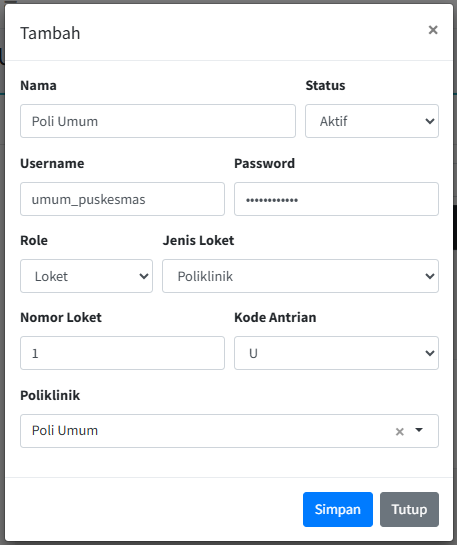

### Tambah Akun User Anjungan

Untuk akun user anjungan yang diberi tanda oval hijau yang di isi, sedangkan yang tanda oval merah tidak di isi.

Gambar 2. 15 Form Tambah Akun User Anjungan

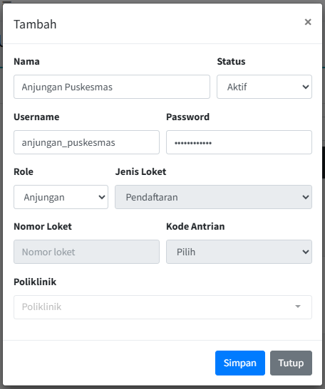

Jika sudah membuat semua akun user sesuai dengan pata pelayanannya maka akan tampil list akun user di menu user dengan fitur-fitur yang tersedia, yaitu pencarian, filter status, filter role, lihat detail, aktif/non aktif kan dan edit user.

Gambar 2. 16 List User Puskesmas

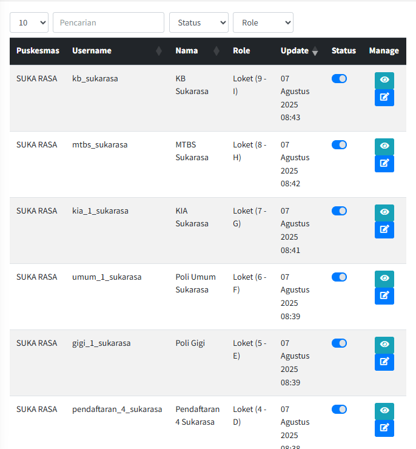

## Tambah Jadwal Praktek

Selanjutnya adalah membuat jadwal praktek, hal ini penting dilakukan karena secara sistem jadwal praktek ini akan terhubung datanya ke anjungan, sehingga pasien bisa memilih jadwal praktek yang tersedia di
puskesmas.

Menu Jadwal Praktek merupakan pusat kendali untuk mengatur dan mengalokasikan tenaga kesehatan secara efisien ke dalam poli-poli yang
tersedia.

Gambar 2. 17 Menu Data Jadwal Praktek

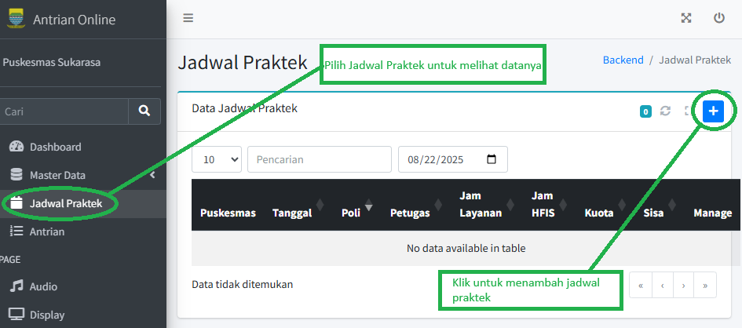

Gambar 2. 18 Tambah Jadwal Praktek

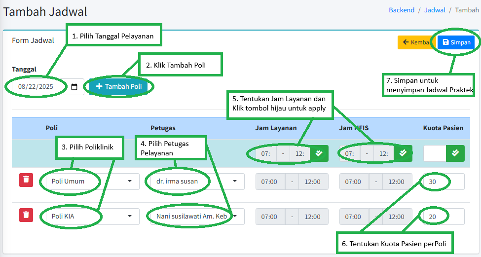

Gambar 2. 19 Data Jadwal Praktek

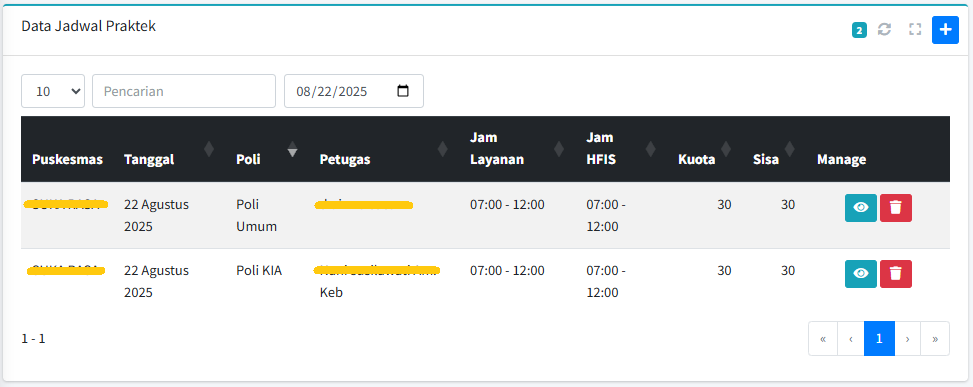

## Konfigurasi Server Antrian

Untuk menjalankan aplikasi antrian diperlukan adanya server antrian, yang berfungsi untuk menghubungkan keseluruhan sistem yang dipakai untuk menjalankan fitur panggil pasien di setiap layanan kesehatan dan juga display antrian untuk tetap secara langsung menampilkan nomor antrian yang di panggil.

### Download Aplikasi Server Antrian

Download Aplikasi Antrian untuk di install ke komputer yang akan di jadikan server.

Gambar 2. 20 Download Aplikasi Server Antrian

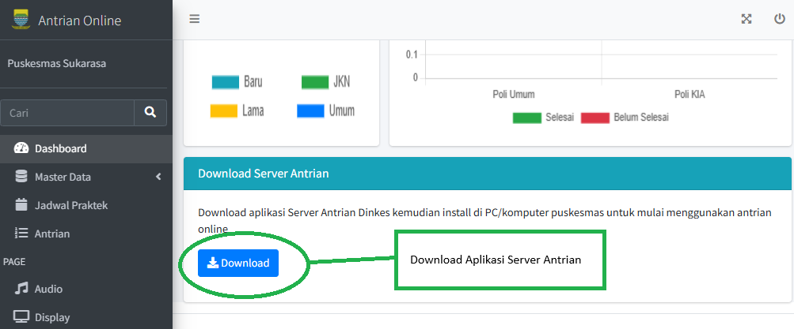

### Install Server Aplikasi Antrian

Setelah Download file berbentuk zip, silahkan untuk di extract terlebih dahulu kemudian klik dua kali untuk install aplikasi server antrian, jika sudah ter install maka server antrian akan langsung online dan berjalan.

Gambar 2. 21 Proses Instalasi Aplikasi Server Antrian

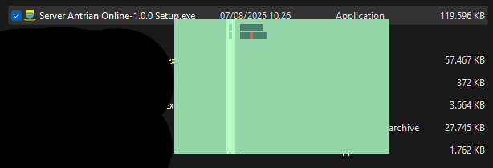

Gambar 2. 22 Aplikasi Server Antrian Berjalan

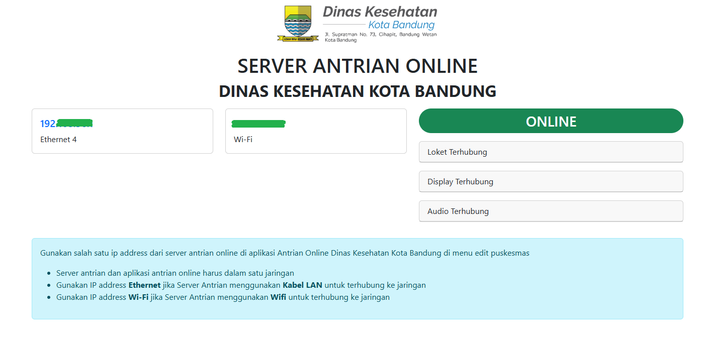

### Penyesuaian Pengaturan Aplikasi Antrian Server

Setelah Server berjalan maka kita harus menyesuaikan alamat ip server di aplikasi antrian, supaya aplikasi bisa terhubung ke server tersebut.

Gambar 2. 23 Pengaturan Master Puskesmas Aplikasi Antrian

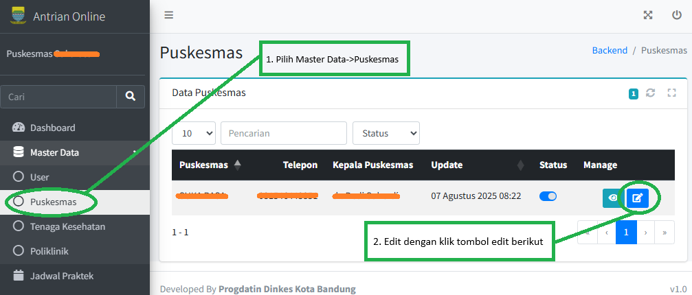

Gambar 2. 24 Penyesuaian IP Server Antrian

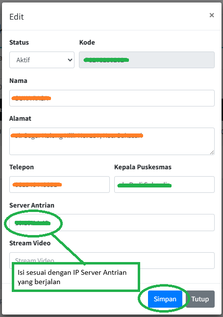

IP server yang berjalan ditujukan oleh Gambar 2.22 Aplikasi Server Antrian Berjalan.

## Video Promkes

Untuk mengatur Video Promosi Kesehatan kita bisa ambil video dari youtube dengan mengambil link youtube dan memasukan nya ke dalam sistem antrian, untuk nanti di tampilkan di display antrian.

Gambar 2. 25 Proses mengambil link Video Promosi Kesehatan

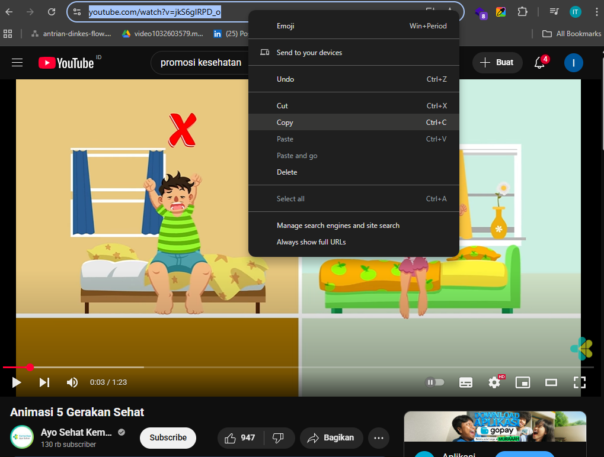

Gambar 2. 26 Menambahkan Video Promosi Kesehatan

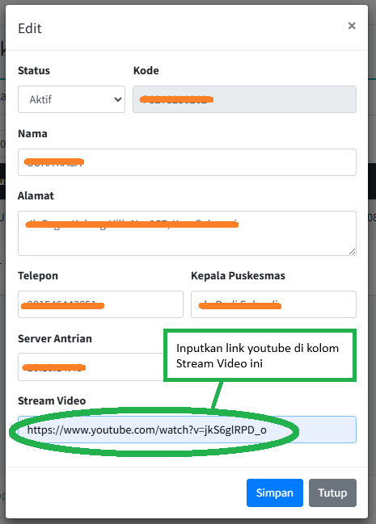

## Setting Audio dan Display Pemanggilan

> Setelah disesuaikan IP Address dan Stream video nya, selanjutnya diperlukan untuk set audio dan display aplikasi antrian, untuk set audio dan display bisa memilih sidebar menu Audio dan Display, bisa juga menyesuaikan sumber suara speaker.

Jika puskesmas mempunya satu lantai, bisa menggunakan satu sumber audio speaker saja, tetapi kalau puskesmas mempunyai lebih dari satu lantai dan ingin di perdengarkan juga bisa di set juga audio dan speakernya di lantai yang lainnya, semua audio sudah terintegrasi jadi satu sehingga tidak akan duplikasi suara atau saling bersahutan.

Set audio dan display tidak hanya ada di akun admin puskesmas, tetapi juga tersedia di akun loket, anjungan ataupun di pendaftaran.

Gambar 2. 27 Menu Set Audio dan Display Aplikasi Antrian Online

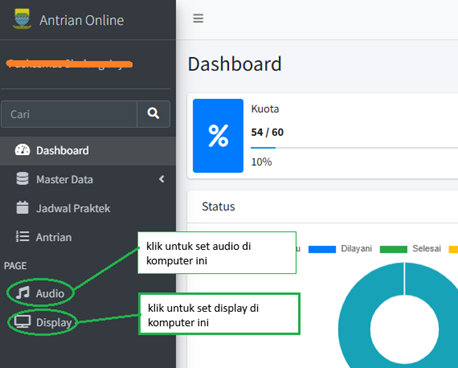

Gambar 2. 28 Set Audio Aplikasi Antrian Berjalan

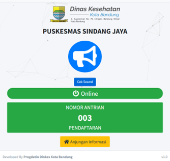

Gambar 2. 29 Set Display Aplikasi Antrian Berjalan

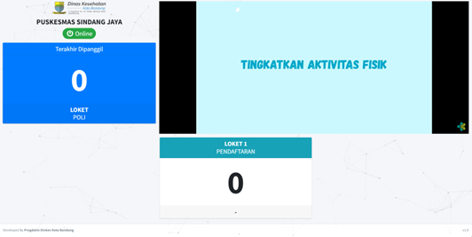

# PENGGUNAAN UNTUK PASIEN

Untuk menggunakan aplikasi antrian puskesmas, pasien cukup mendatangi Anjungan Mandiri yang tersedia di lokasi puskesmas, lalu pada layar sentuh tersedia opsi untuk memilih jenis layanan yang dibutuhkan---apakah sebagai pasien baru atau pasien lama---serta tujuan poli atau layanan tertentu; setelah memilih, nomor antrian akan tercetak secara otomatis, dan pasien hanya perlu menunggu di area tunggu yang telah disediakan hingga nomor antrian mereka dipanggil melalui monitor atau pengeras suara untuk menuju ke loket pendaftaran, poli atau kasir sesuai dengan urutan.

## Menggunakan Anjungan Mandiri

Aplikasi Antrian bisa diakses menggunakan browser, jika sudah di akses dan login ke akun anjungan kemudian pilih Anjungan Mandiri, maka Anjungan sudah siap digunakan oleh Pasien secara mandiri mendaftar dan mengambil tiket antrian.

Gambar 3. 1 Tampilan Anjungan Mandiri untuk Cetak Antrian Pasien

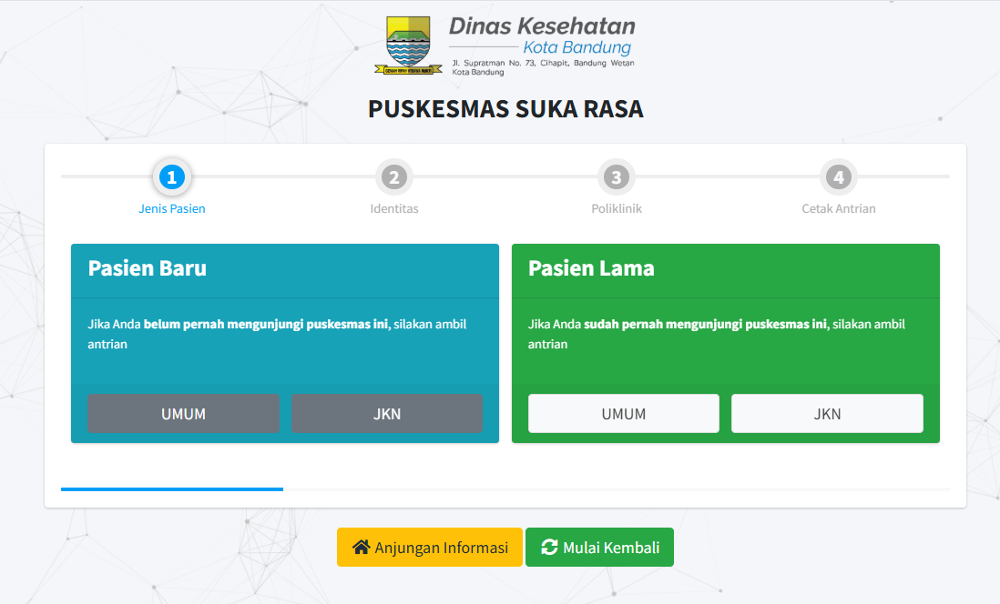

### Cetak Antrian Pasien Baru

Pasien Baru adalah pasien yang belum pernah melakukan pelayanan kesehatan di puskesmas dan pasti data pasien belum ada di database SIKDA, ketika akan cetak antrian pasien diberikan dua pilihan yaitu pasien umum dan pasien jkn, setelah memilih jenis pasien maka pasien harus menginputkan NIK pasien di inputan anjungan, kemudian pasien memilih layanan yang tersedia atau pilih poliklinik yang tersedia, setelah itu pasien bisa mencetak tiket antrian yang akan keluar tiket nya di mesin anjungan.

Gambar 3. 2 Cetak Tiket Antrian Pasien Baru Umum & JKN/BPJS

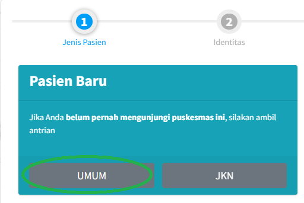

Gambar 3. 3 Cetak Tiket Antrian Pasien Baru Umum Masukan NIK

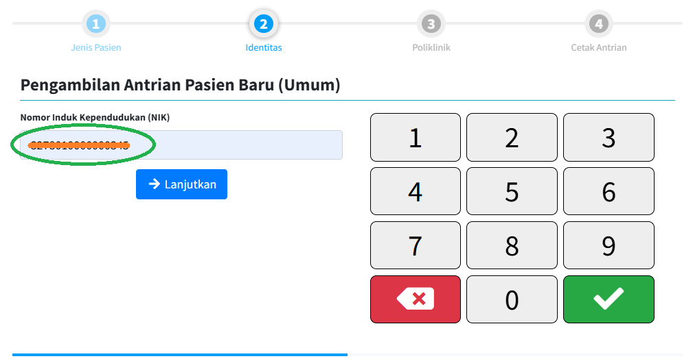

Gambar 3. 4 Cetak Tiket Antrian Pasien Baru JKN/BPJS Masukan NIK

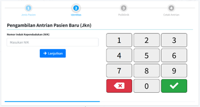

Gambar 3. 5 Cetak Tiket Antrian Pasien Baru Umum/JKN/BPJS Pilih Poli

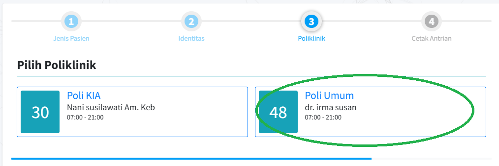

Gambar 3. 6 Cetak Antrian Pasien Baru Umum Cetak Tiket

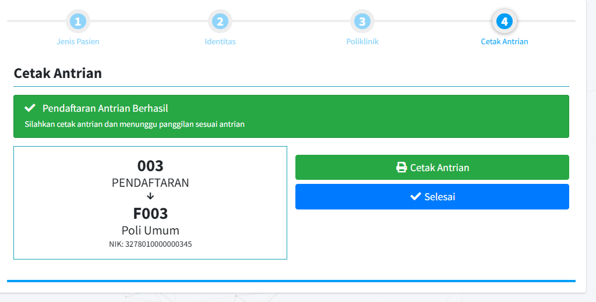

Gambar 3. 7 Tampilan Tiket Antrian Pasien Baru Umum

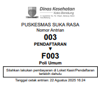

Gambar 3. 8 Tampilan Tiket Antrian Pasien Baru JKN/BPJS

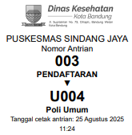

Setelah Pasien Baru Cetak tiket antrian maka pasien bisa langsung menuju pendaftaran untuk menunggu antrian Pendaftaran yang akan didaftarkan dan dimasukan datanya ke SIKDA dan selanjutnya jika pasien umum lanjut ke Kasir untuk pembayaran pelayanan, dan jika pasien JKN bisa langsung menuju Poli untuk menunggu antrian Poli.

### Cetak Antrian Pasien Lama

Pasien lama adalah pasien yang sudah pernah berkunjung dan berobat ke puskesmas yang datanya sudah ada di database SIKDA, ketika akan cetak antrian pasien lama diberikan pilihan yaitu jenis kategor Umum atau JKN, jika pasien adalah Umum maka pasien diarahkan ke kasir untuk membayar biaya pelayanan, jika pasien JKN maka pasien bisa langsung menuju Poli sesuai yang dituju dan menunggu antrian Poli untuk di panggil untuk dilakukan Pelayanan Kesehatan.

Gambar 3. 9 Cetak Antrian Pasien Lama

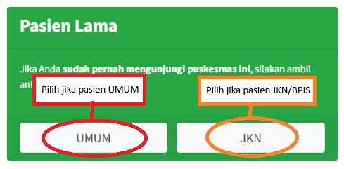

Gambar 3. 10 Cetak Antrian Pasien Lama Input Data NIK/RM Pasien Umum

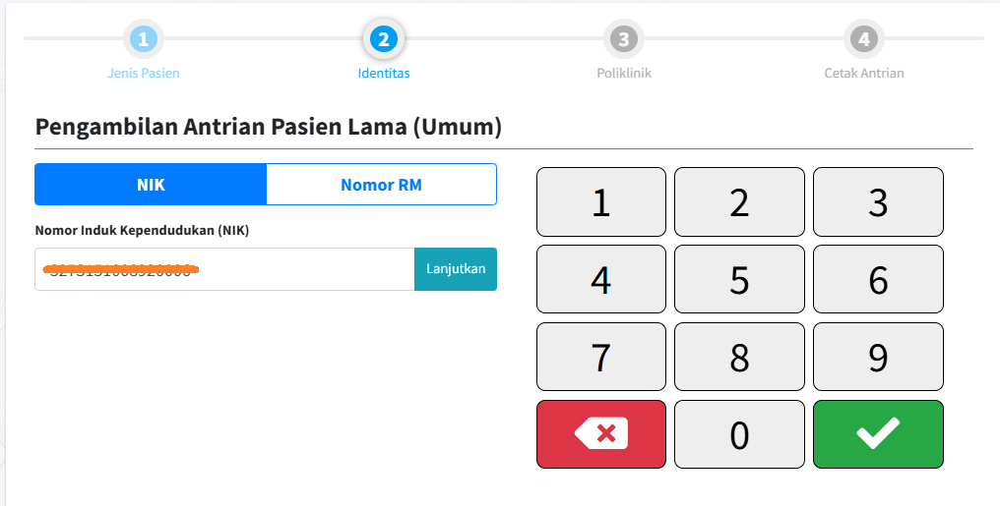

Gambar 3. 11 Cetak Antrian Pasien Lama Input Data NIK/RM/No. BPJS Pasien JKN/BPJS

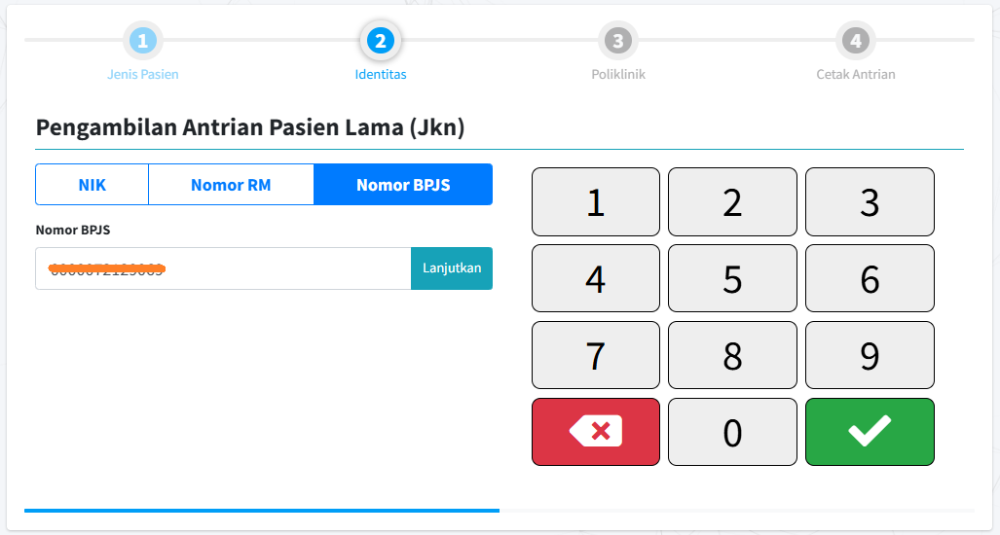

Gambar 3. 12 Cetak Antrian Pasien Lama Verifikasi Data Pasien Umum

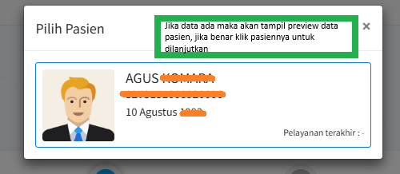

Gambar 3. 13 Cetak Antrian Pasien Lama Verifikasi Data Pasien JIKN/BPJS

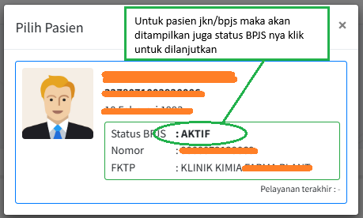

Gambar 3. 14 Cetak Antrian Pasien Lama Pilih Poli

Gambar 3. 15 Cetak Antrian Pasien Lama sudah dapat nomor antrian

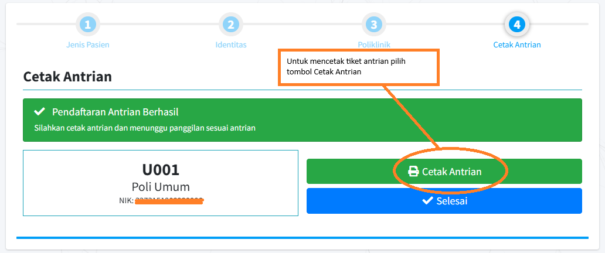

Gambar 3. 16 Tampilan Tiket Antrian Pasien Lama Umum

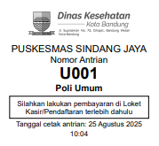

Gambar 3. 17 Tampilan Tiket Antrian Pasien Lama JIKN/BPJS

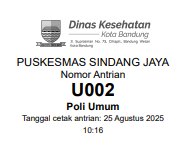

# PENGGUNAAN UNTUK PETUGAS PENDAFTARAN

Sebagai petugas pendaftaran, Anda akan mengawali sesi kerja dengan melakukan login ke dalam sistem aplikasi antrian menggunakan akun khusus yang telah diberikan, kemudian pada antarmuka utama Anda dapat melihat daftar antrian pasien yang telah mengambil nomor melalui anjungan mandiri; untuk memanggil pasien berikutnya, cukup klik tombol  \"Panggil Antrian\" pada layar yang akan mengupdate nomor yang sedang dilayani secara real-time di monitor tunggu dan mengirim suara panggilan, lalu saat pasien telah berada di loket, lakukan proses pendaftaran dengan memasukkan data pasien ke dalam sistem SIKDA untuk pasien baru, dan setelah selesai klik tombol "Selesai Pendaftaran", secara sistem akan mengecek kesesuaian dengan database SIKDA jika sudah sama maka status terdaftar akan berubah menjadi hijau, dan pasien akan dilanjutkan ke alur selanjutnya (JKN langsung ke Poli, Umum langsung ke Kasir).

## Login ke akun pendaftaran

Langkah-langkah:

1)  Buka aplikasi melalui browser.

2)  Masukkan Username dan Password akun pendaftaran.

Gambar 2. 30 Login akun Pendaftaran

1)  Klik tombol \"Login\".

Setelah berhasil, Anda akan masuk ke halaman pendaftaran.

Gambar 4. 1 Halaman Loket Pendaftaran

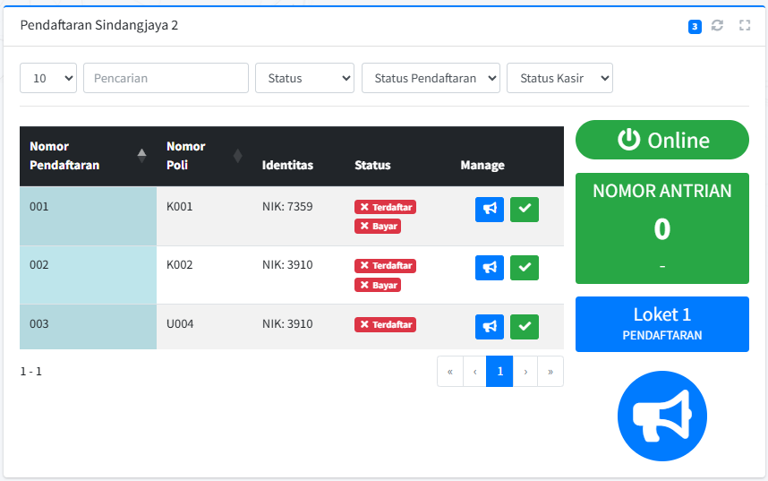

## Memanggil antrian pasien baru

Langkah-langkah:

1)  Klik tombol Panggil Antrian
     untuk memanggil pasien.

Gambar 4. 2 Tombol untuk memanggil Pasien

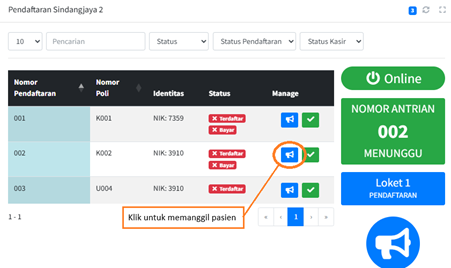

2)  Setelah pasien datang ke pendaftaran dilanjutkan dengan proses
    pendaftaran pasien di SIKDA.

## Proses Pendaftaran pasien di SIKDA

Daftarkan pasien baru di sistem SIKDA, prosesnya sama dengan yang sekarang biasa dilakukan di puskesmas.

Gambar 4. 3 Proses Pendaftaran Pasien Baru di SIKDA

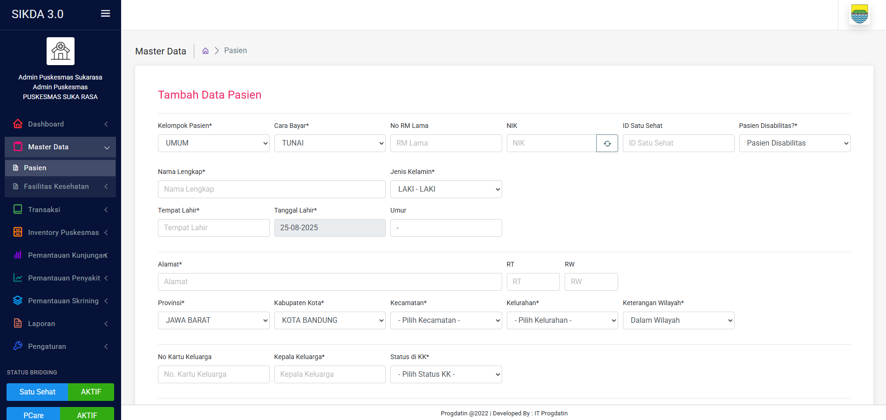

## Selesaikan / Validasi Proses Pendaftaran

Langkah-langkahnya:

1)  Setelah selasai mendaftarakan di SIKDA, selanjutnya di aplikasi
    antrian di halaman pendaftaran klik tombol
     "Selesai Pendaftaran", maka sistem
    akan mengecek apakah data identitas sudah ada di database SIKDA,
    jika ada maka akan menmpilkan konfirmasi pembayaran.

Gambar 4. 4 Tombol Selesaikan Pendaftaran

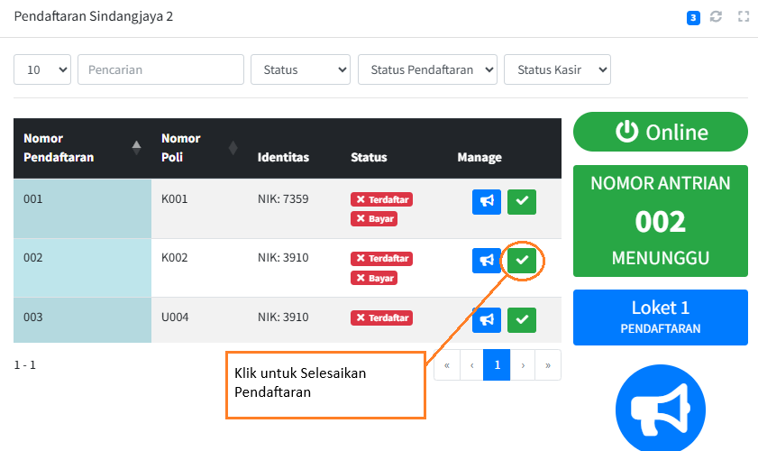

2)  Konfirmasikan Pembayaran, jika pasien JKN/BPJS silahkan untuk klik
    , jika pasien umum silahkan untuk
    klik .

Gambar 4. 5 Konfirmasi Pembayaran Pasien

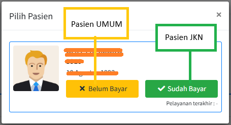

3)  Jika sudah dikonfirmasi pembayarannya maka data pasien yang tadinya
    ada di data antrian akan otomatis hilang dan diarahkan pasiennya ke
    kasir jika pasien umum, jika pasien baru diarahkan ke poli, sesuai
    flow di Gambar 1.2 Flow Diagram Aplikasi.

# PENGGUNAAN UNTUK PETUGAS KASIR

Sebagai petugas kasir, Anda memulai tugas dengan melakukan login ke akun kasir pada aplikasi antrian puskesmas untuk mengakses halaman kasir. Setelah masuk, sistem akan menampilkan daftar pasien yang telah dirujuk dari pendaftaran atau poli bagi yang terlewat pembayaran untuk melakukan pembayaran; untuk memanggil pasien, klik tombol \"Panggil Antrian Kasir\" yang akan menampilkan nomor dan nama pasien pada monitor tunggu serta mengaktifkan panggilan suara. Setelah pasien datang ke loket, lakukan proses pembayaran untuk pasien umum, lalu klik tombol  'Sudah Bayar' untuk menandai bahwa pasien sudah membayar dan lunas, selanjutnya pasien umum diarahkan untuk menuju ke poli untuk menunggu pelayanan kesehatan.

## Login ke Akun Kasir

Langkah-langkah:

1)  Buka aplikasi melalui browser.

2)  Masukkan Username dan Password akun kasir.

Gambar 5. 1 Login akun Kasir

3)  Klik tombol \"Login\".

Setelah berhasil, Anda akan masuk ke halaman kasir.

Gambar 5. 2 Halaman Kasir

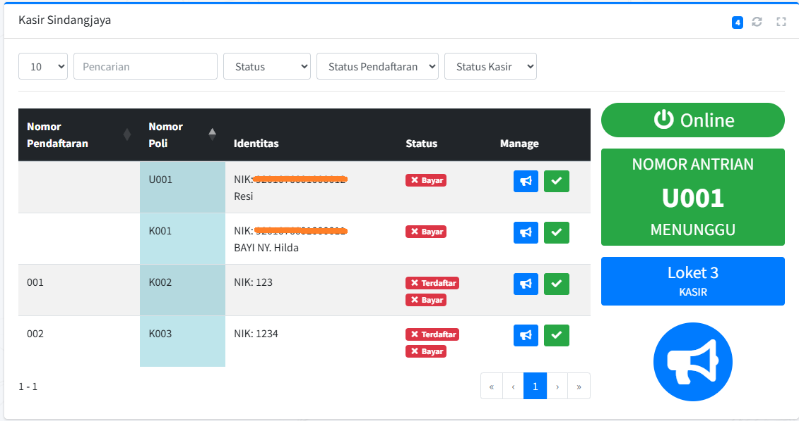

## Memanggil Antrian Pasien untuk Pembayaran

Untuk memanggil pasien bisa klik tombol  "Panggil Antrian" maka akan muncul audio pemanggilan antrian.

Gambar 5. 3 Tampilan Tombol Panggil Pasien Kasir, Sudah Bayar, dan Status Pembayaran

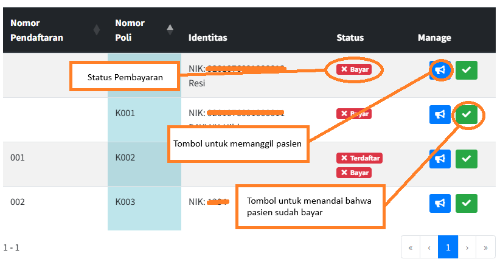

## Proses Pembayaran (Pasien Umum)

Jika pasien sudah bayar maka petugas kasir menandai bahwa pasien sudah membayar dengan klik tombol  "Sudah Bayar" seperti gambar diatas, maka pasien yang sudah bayar akan otomatis hilang dan tersisi pasien lain yang belum bayar.

# PENGGUNAAN UNTUK PETUGAS POLI

## Login ke Poli

Langkah-langkah:

1)  Buka aplikasi melalui browser.

2)  Masukkan Username dan Password akun loket poli.

Gambar 6. 1 Login akun loket poli

1)  Klik tombol \"Login\".

Setelah berhasil, Anda akan masuk ke halaman Poli.

Gambar 6. 2 Tampilan Halaman Poli

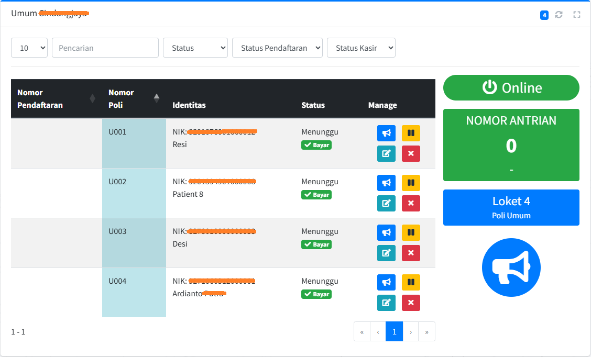

## Memanggil antrian poli

Untuk memanggil antrian Poli tekan tombol "Panggil Antrian".

Gambar 6. 3 Panggil Antrian Poli

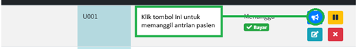

## Input Pelayanan Kesehatan di SIKDA

Setelah pasien di panggil maka klik tombol  "Dilayani" untuk dilanjutkan dengan proses Input pelayanan pasien di SIKDA.

Gambar 6. 4 Memulai Pelayanan Poli

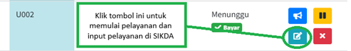

Gambar 6. 5 Proses Pelayanan Pasien di SIKDA

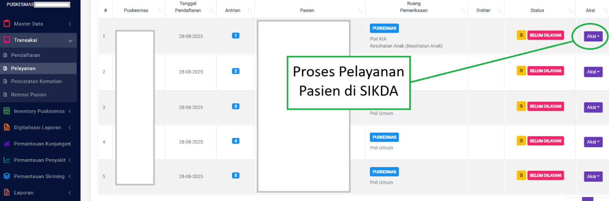

Gambar 6. 6 Selesaikan Pelayanan Poli

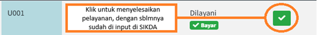

## Keterangan Tambahan Pelayanan

Pemanggilan di rekomendasikan sesuai dengan urutan antrian nomor poli dan yang sudah membayar, jika ada keterangan status nya belum bayar maka tidak di prioritaskan untuk di panggil, karena bisa jadi belum selesai pembayaran di kasir sebagai pasien umum.

Gambar 6. 7 Keterangan icon tambahan di Pelayanan

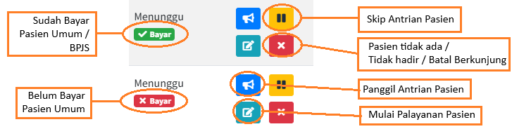

# LAMPIRAN

## Manual Book PDF

> Petunjuk Teknis / Manual Book versi PDF : <a href="https://drive.google.com/file/d/1ucNyZfD94ymCCKPHEgbAdJelifDYH-7u/view?usp=sharing" target="_blank">Lihat / Download disini</a>

## Link Akses Aplikasi

### Aplikasi Antrian

> Aplikasi Antiran Development : http://10.11.10.23

### Aplikasi SIKDA Kota Bandung

> Aplikasi SIKDA Production (Live) :\
> http://sikda.dinkes-bandung.id/sikda_3.0/
