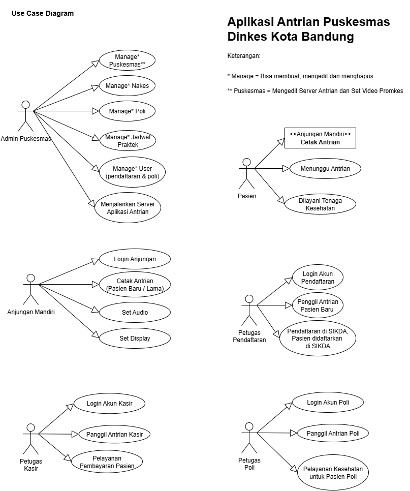
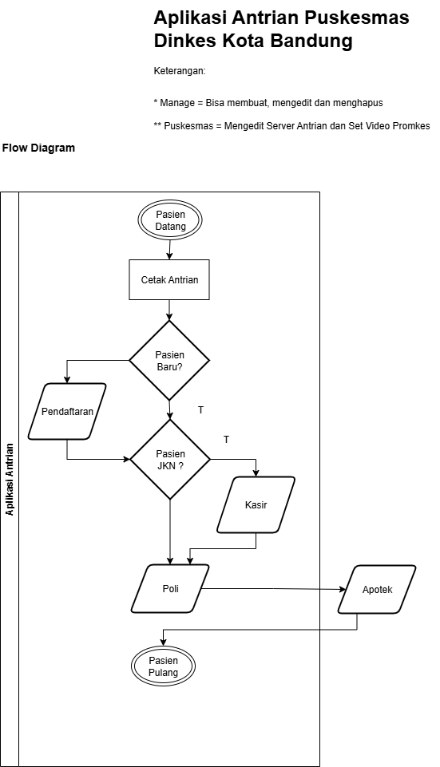
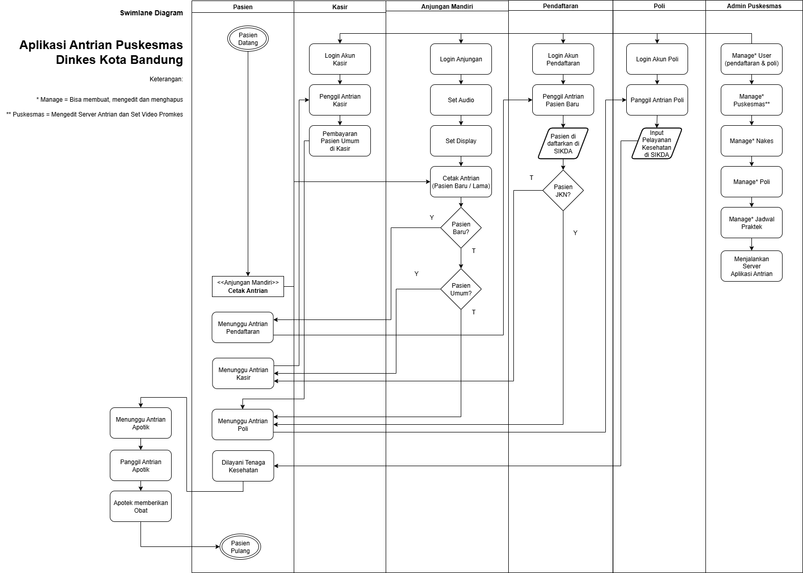

### DOKUMENTASI TEKNIS

##### Update : 8 September 2025

# PENDAHULUAN

## Gambaran Umum Aplikasi dan Manfaatnya

Aplikasi Antrian Puskesmas Dinkes Kota Bandung adalah solusi digital yang dirancang untuk mempermudah proses pelayanan kesehatan di puskesmas. Aplikasi ini menyederhanakan alur antrian pasien, pendaftaran, pembayaran, hingga pelayanan poli, sehingga mengurangi
waktu tunggu dan meningkatkan efisiensi bagi pasien maupun petugas.

### Use Case Diagram Aplikasi

### Flow Diagram Aplikasi

### Swimlane Diagram Aplikasi

### Fitur Utama

1)  Anjungan Mandiri

    a.  Pasien dapat mencetak nomor antrian secara mandiri berdasarkan jenis layanan (baru/lama, poli, atau kasir).

    b.  Dilengkapi pengaturan audio dan display untuk aksesibilitas.

2)  Manajemen Antrian Terintegrasi

    a.  Antrian terpusat untuk pendaftaran, poli, kasir, dan apotek.

    b.  Pemanggilan antrian digital oleh petugas secara real-time.

3)  Dukungan Multi-Role

    a.  Petugas Pendaftaran: Input data pasien baru/lama ke sistem SIKDA.

    b.  Petugas Poli: Mencatat pelayanan kesehatan langsung di sistem.

    c.  Petugas Kasir/Apotek: Proses pembayaran dan pengambilan obat terautomasi.

    d.  Admin Puskesmas: Kelola data tenaga kesehatan, jadwal, dan konfigurasi server.

4)  Integrasi dengan SIKDA

    a.  Data pasien tersinkronisasi dengan Sistem Informasi Kesehatan Daerah (SIKDA) untuk akurasi rekam medis.

### Manfaat Aplikasi

1)  Bagi Pasien

    a.  Lebih Cepat: Tidak perlu antri manual sejak awal.

    b.  Transparan: Nomor antrian dan status layanan dapat dipantau.

    c.  Fleksibel: Mendukung pasien JKN (BPJS) dan umum.

2)  Bagi Petugas Puskesmas

    a.  Efisiensi Waktu: Kurangi beban administrasi dengan sistem terdigitalisasi.

    b.  Minim Kesalahan: Data pasien tercatat otomatis dan terintegrasi.

> Dengan aplikasi ini, pelayanan kesehatan puskesmas menjadi lebih tertata, cepat, dan ramah pengguna.

## Daftar Pengguna (Role) dan Fungsinya

Aplikasi Antrian Puskesmas Dinkes Kota Bandung digunakan oleh berbagai peran (role) dengan fungsi yang berbeda-beda. Berikut penjelasan lengkapnya:

### Admin Puskesmas

-   Fungsi:

    -   Login ke dashboard admin untuk mengelola sistem.

    -   Manajemen Pengguna:Membuat, mengedit, atau menghapus akun petugas (pendaftaran, poli, kasir).

    -   Manajemen Layanan:Mengatur data tenaga kesehatan (nakes), poli, dan jadwal praktik.

    -   Konfigurasi Sistem: Mengatur server antrian dan konten promosi kesehatan (video promkes).

-   Hak Akses:

    -   Akses penuh ke semua fitur administrasi.

    -   Monitoring seluruh aktivitas antrian.

### Pasien

-   Fungsi:

    -   Mencetak nomor antrian secara mandiri melalui Anjungan Mandiri.

    -   Memilih jenis layanan (pasien baru/lama, poli, atau pembayaran).

    -   Menunggu pemanggilan antrian sesuai kebutuhan (pendaftaran, poli, kasir).

    -   Mendapatkan pelayanan kesehatan setelah dipanggil oleh petugas.

-   Hak Akses:

    -   Menggunakan Anjungan Mandiri untuk mengambil antrian.

    -   Melihat informasi antrian dan status layanan.

### Petugas Pendaftaran

-   Fungsi:

    -   Login ke sistem menggunakan akun pendaftaran.

    -   Memanggil antrian pasien baru/lama.

    -   Melakukan pendaftaran pasien dan memasukkan data ke Sistem Informasi Kesehatan Daerah (SIKDA).

    -   Memverifikasi kepesertaan JKN (BPJS Kesehatan) jika diperlukan.

    -   Mengarahkan pasien ke poli atau kasir sesuai kebutuhan.

-   Hak Akses:

    -   Akses ke modul pendaftaran pasien.

    -   Input dan edit data pasien di SIKDA.

### Petugas Poli

-   Fungsi:

    -   Login ke sistem menggunakan akun poli.

    -   Memanggil antrian pasien yang menunggu di poli.

    -   Mencatat hasil pemeriksaan atau pelayanan kesehatan di SIKDA.

    -   Mengarahkan pasien ke apotek jika memerlukan obat.

-   Hak Akses:

    -   Akses ke modul list pasien yang akan melakukan pelayanan poli.

    -   Input data rekam medis pasien di SIKDA.

### Petugas Kasir

-   Fungsi:

    -   Login ke sistem menggunakan akun kasir.

    -   Memanggil antrian pasien yang membutuhkan pembayaran.

    -   Melakukan proses pembayaran (untuk pasien umum).

-   Hak Akses:

    -   Akses ke list pasien yang akan melakukan pembayaran (kasir).

Pentingnya Peran Masing-Masing Pengguna, setiap role memiliki tanggung jawab yang saling terkait untuk memastikan pelayanan kesehatan berjalan lancar. 
>Dengan pembagian tugas yang jelas, aplikasi ini membantu mengurangi antrian manual, meminimalkan kesalahan data, dan meningkatkan efisiensi waktu bagi pasien dan petugas.
