# PANDUAN ADMIN PUSKESMAS

Ada beberapa langkah yang harus di set oleh admin puskesmas untuk kebutuhan memulai aplikasi antrian ini, berikut urutan langkah yang harus di set oleh admin puskesmas.

## Tahapan Pengaturan Aplikasi oleh Admin Puskesmas

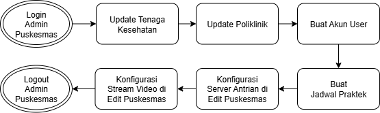

## Peta Pelayanan 
Selanjutnya disarankan untuk membuat Peta Pelayanan terlebih dahulu untuk memudahkan visualisasi titk layanan di Puskesmas. Peta pelayanan puskesmas merupakan panduan visual / tekstual yang menampilkan ketersediaan layanan, lokasi layanan, dan peran petugas di Puskesmas.

Dibawah ini adalah contoh Peta Pelayanan dan dapat disesuaikan dengan puskesmas masing-masing.

Contoh Peta Pelayanan Puskesmas

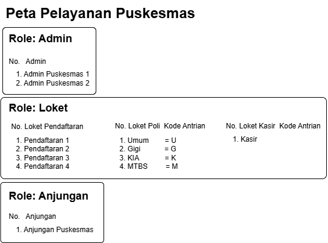

Jika sudah membuat Peta Layanan dan tergambar role dan pengguna nya maka Selanjutnya kita bisa memulai langkah-langkah Tahapan Pengaturan Aplikasi Antrian seperti yang ditujukan pada Gambar Tahapan Pengaturan.

## Login ke Dashboard Admin

Langkah-langkah:

1)  Buka aplikasi melalui browser.

2)  Masukkan Username dan Password admin puskesmas.

3)  Klik tombol \"Login\".

4)  Setelah berhasil, Anda akan masuk ke Dashboard Admin.

Dashboard Admin

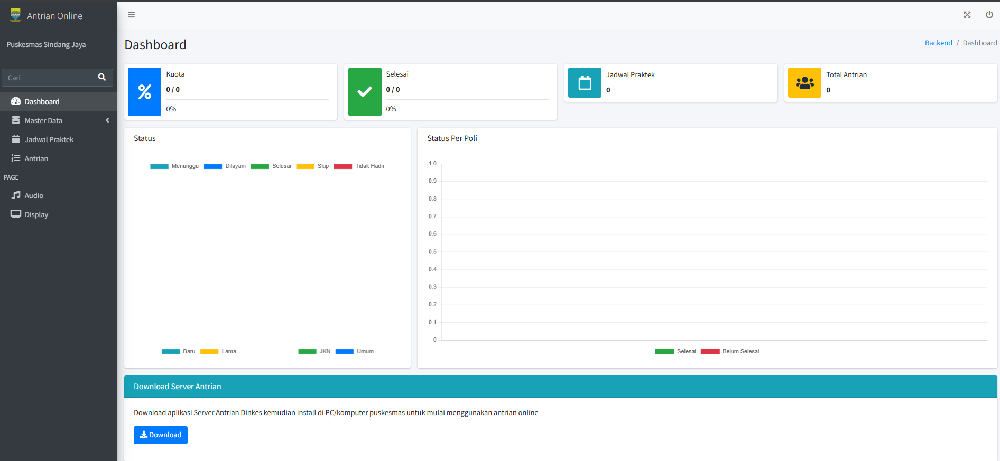

## Update Tenaga Kesehatan

Data Tenaga Kesehatan sudah terintegrasi dengan aplikasi SIKDA, sehingga untuk menambahkan tenaga kesehatan kita cukup untuk meng-update saja, ketika sudah di update maka data akan sesuai dengan data tenaga kesehatan di SIKDA, berikut cara update tenaga kesehatan.

Update Tenaga Kesehatan

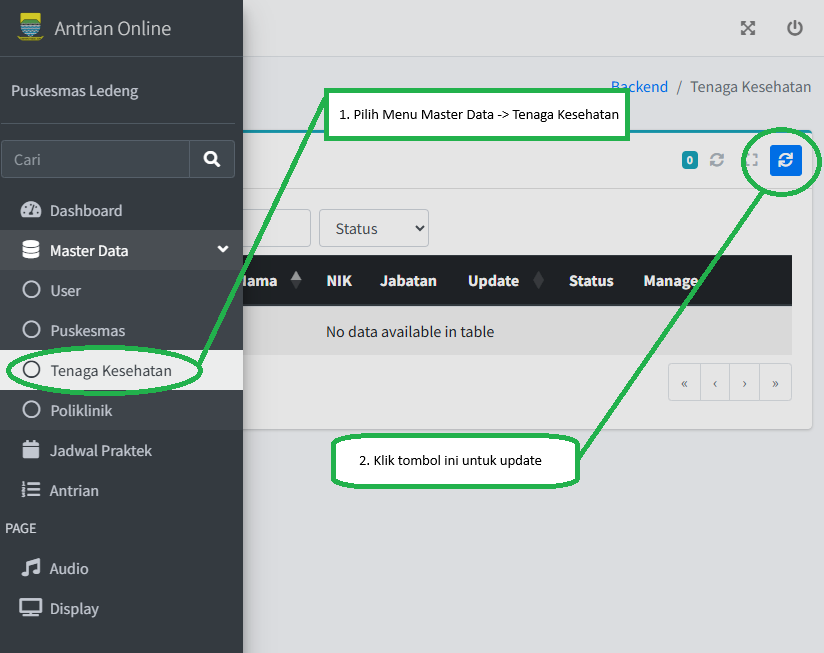

Fitur Data Tabel Nakes

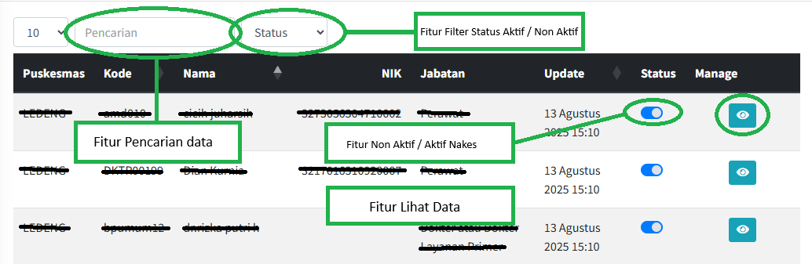

## Update Poliklinik

Untuk data Poliklinik sudah terintegrasi dengan SIKDA, sehingga untuk menambahkan data Poliklinik kita tinggal update saja, ketika sudah di update maka data akan sesuai dengan yang ada di SIKDA, berikut cara update Poliklinik.

Update Poliklinik

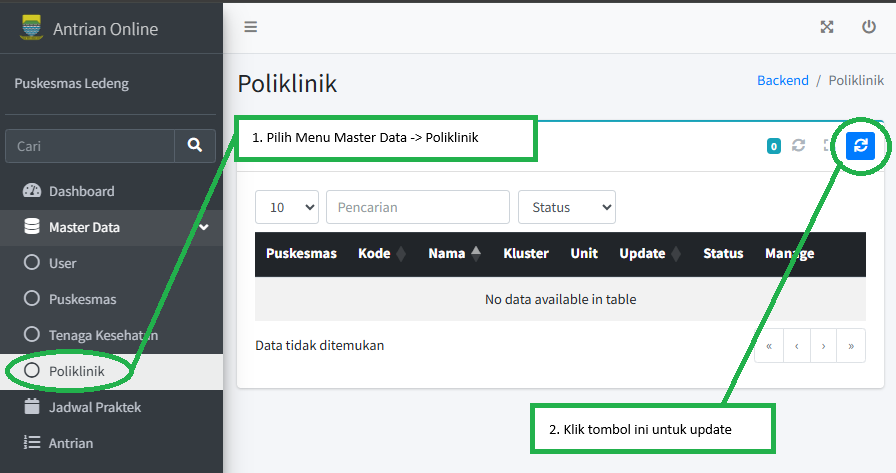

Fitur Data Tabel Poliklinik

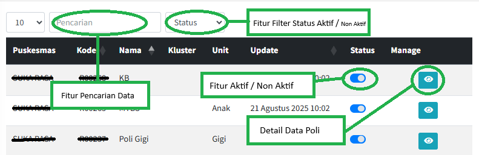

## Mengatur Akun User

Sebagai Admin Puskesmas, Anda memiliki kewenangan penuh untuk mengelola semua akun pengguna (user) dalam sistem aplikasi antrian. Akun-akun ini menentukan akses dan fungsi setiap petugas di puskesmas, seperti petugas pendaftaran, poli, kasir, dan anjungan. Pengelolaan akun yang baik memastikan bahwa hanya orang yang berwenang yang dapat mengakses sistem dan setiap tindakan dapat dilacak.

Sebagai Admin Puskesmas anda bisa Mengatur User untuk:

1)  Membuat akun pengguna baru.

2)  Melihat daftar semua pengguna yang terdaftar.

3)  Mengedit data pengguna yang sudah ada (misalnya, mengganti password
    atau role).

4)  Menonaktifkan atau Menghapus akun yang sudah tidak digunakan.

Ketika kita akan membuat / mengatur User maka Peta Pelayanan yang sudah dibuat memudahkan kita untuk me-meta-kan kita dalam pembuatan user seperti di Gambar 2.2. Contoh Peta Pelayanan Puskesmas, silahkan buat user sesuai dengan peta pelayanan yang sudah dibuat, berikut cara menambahkan akun user.

Gambar 2.9 Tambah Akun User

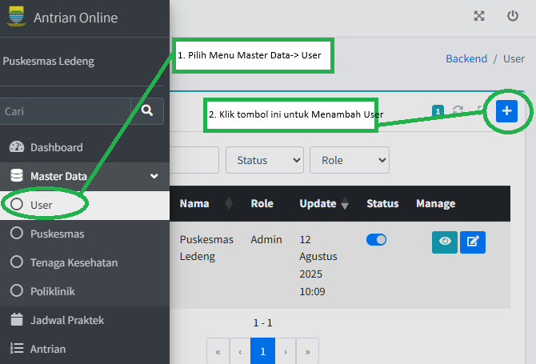

### Tambah Akun User Admin

Ketika menambahkan akun user admin akan ada pengisian form, berikut form isian yang bisa di isi ditunjukan dengan lingkaran oval hijau.

Gambar 2. 10 Form Tambah Akun User Admin

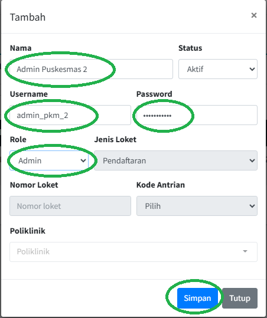

### Tambah Akun User Loket

Untuk menambahkan akun user loket fokuskan ke bagian role di form, pilih role nya adalah Loket.

Gambar 2. 11 Role Akun Loket

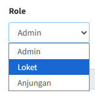

#### Akun User Loket Pendaftaran

Untuk Loket Pendaftaran yang perlu di isi adalah bagian yang diberi tanda oval hijau, sedangkan yang tanda oval merah tidak di isi.

Gambar 2. 12 Form Tambah Akun Loket
Pendaftaran

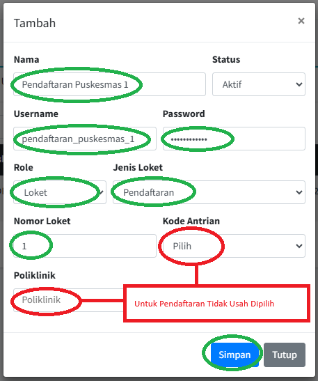

#### Akun User Loket Kasir

Untuk Loket Kasir yang perlu di isi adalah bagian yang diberi tanda oval hijau, sedangkan yang tanda oval merah tidak di isi.

Gambar 2. 13 Form Tambah Akun Loket Kasir

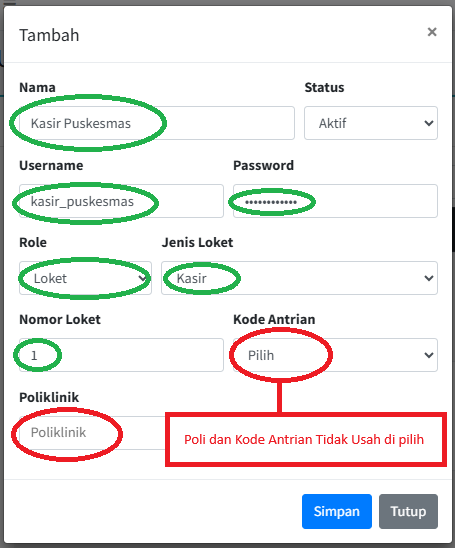

#### Akun User Loket Poliklinik

Untuk akun user loket Poliklinik semua isian harus di isi dan disesuaikan dengan Peta Pelayanan yang sudah dibuat sesuai dengan contoh di Gambar 2.2 Peta Pelayanan Puskesmas.

Gambar 2. 14 Form Tambah Akun Loket Poliklinik

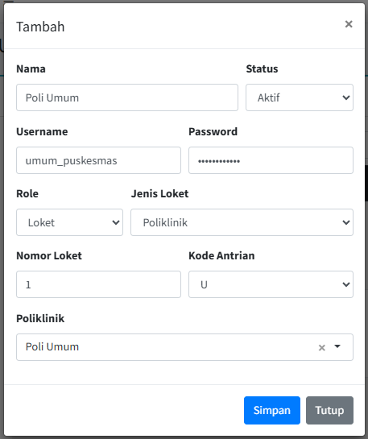

### Tambah Akun User Anjungan

Untuk akun user anjungan yang diberi tanda oval hijau yang di isi, sedangkan yang tanda oval merah tidak di isi.

Gambar 2. 15 Form Tambah Akun User Anjungan

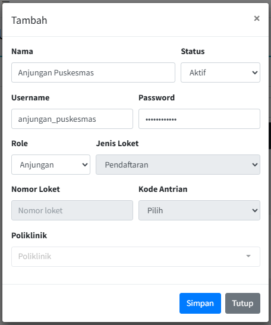

Jika sudah membuat semua akun user sesuai dengan pata pelayanannya maka akan tampil list akun user di menu user dengan fitur-fitur yang tersedia, yaitu pencarian, filter status, filter role, lihat detail, aktif/non aktif kan dan edit user.

Gambar 2. 16 List User Puskesmas

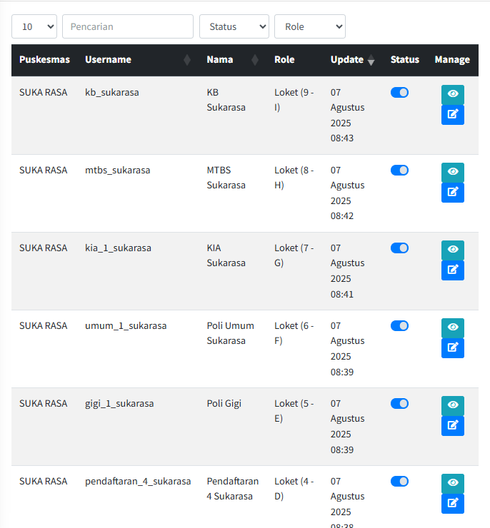

## Tambah Jadwal Praktek

Selanjutnya adalah membuat jadwal praktek, hal ini penting dilakukan karena secara sistem jadwal praktek ini akan terhubung datanya ke anjungan, sehingga pasien bisa memilih jadwal praktek yang tersedia di
puskesmas.

Menu Jadwal Praktek merupakan pusat kendali untuk mengatur dan mengalokasikan tenaga kesehatan secara efisien ke dalam poli-poli yang
tersedia.

Gambar 2. 17 Menu Data Jadwal Praktek

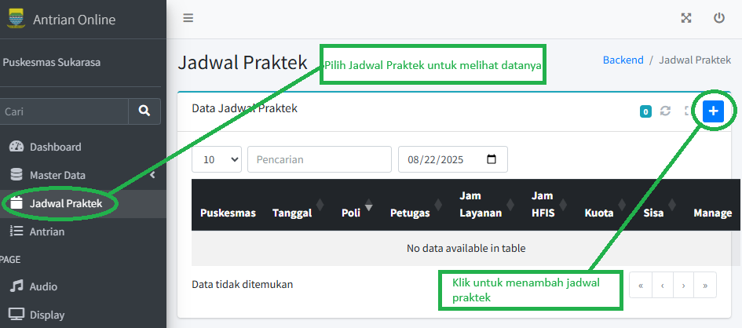

Gambar 2. 18 Tambah Jadwal Praktek

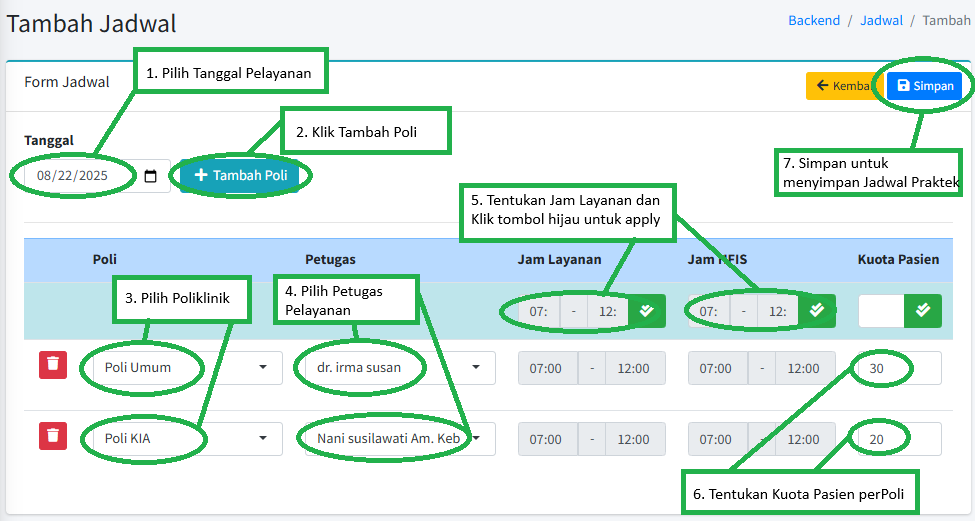

Gambar 2. 19 Data Jadwal Praktek

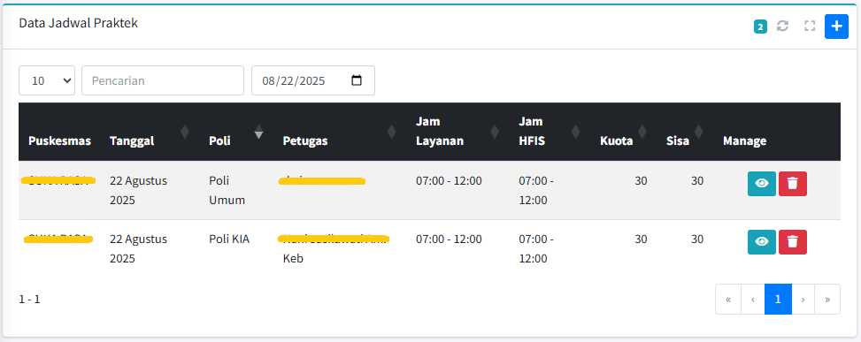

## Konfigurasi Server Antrian

Untuk menjalankan aplikasi antrian diperlukan adanya server antrian, yang berfungsi untuk menghubungkan keseluruhan sistem yang dipakai untuk menjalankan fitur panggil pasien di setiap layanan kesehatan dan juga display antrian untuk tetap secara langsung menampilkan nomor antrian yang di panggil.

### Download Aplikasi Server Antrian

Download Aplikasi Antrian untuk di install ke komputer yang akan di jadikan server.

Gambar 2. 20 Download Aplikasi Server Antrian

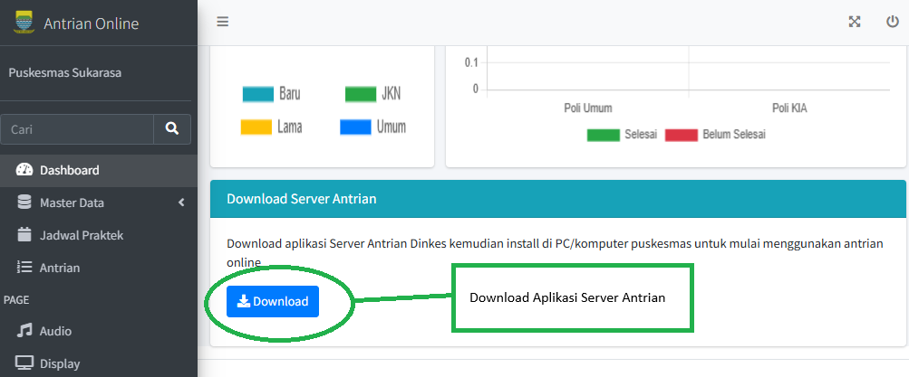

### Install Server Aplikasi Antrian

Setelah Download file berbentuk zip, silahkan untuk di extract terlebih dahulu kemudian klik dua kali untuk install aplikasi server antrian, jika sudah ter install maka server antrian akan langsung online dan berjalan.

Gambar 2. 21 Proses Instalasi Aplikasi Server Antrian

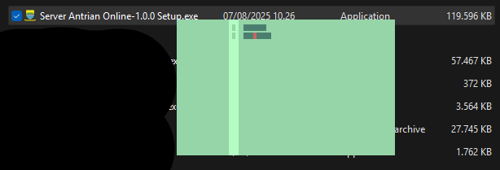

Gambar 2. 22 Aplikasi Server Antrian Berjalan

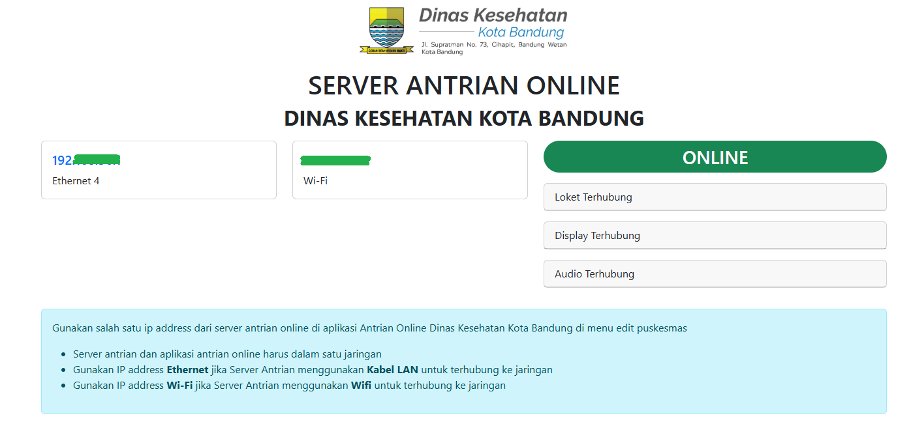

### Penyesuaian Pengaturan Aplikasi Antrian Server

Setelah Server berjalan maka kita harus menyesuaikan alamat ip server di aplikasi antrian, supaya aplikasi bisa terhubung ke server tersebut.

Gambar 2. 23 Pengaturan Master Puskesmas Aplikasi Antrian

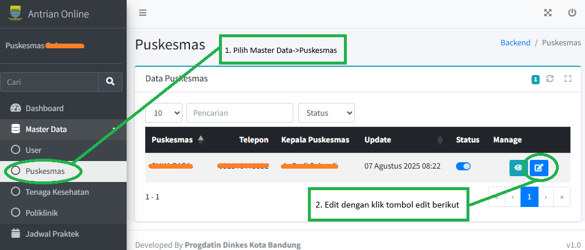

Gambar 2. 24 Penyesuaian IP Server Antrian

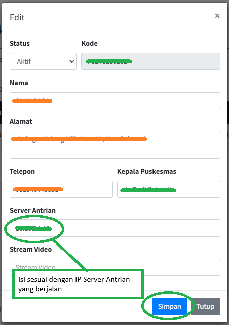

IP server yang berjalan ditujukan oleh Gambar 2.22 Aplikasi Server Antrian Berjalan.

## Video Promkes

Untuk mengatur Video Promosi Kesehatan kita bisa ambil video dari youtube dengan mengambil link youtube dan memasukan nya ke dalam sistem antrian, untuk nanti di tampilkan di display antrian.

Gambar 2. 25 Proses mengambil link Video Promosi Kesehatan

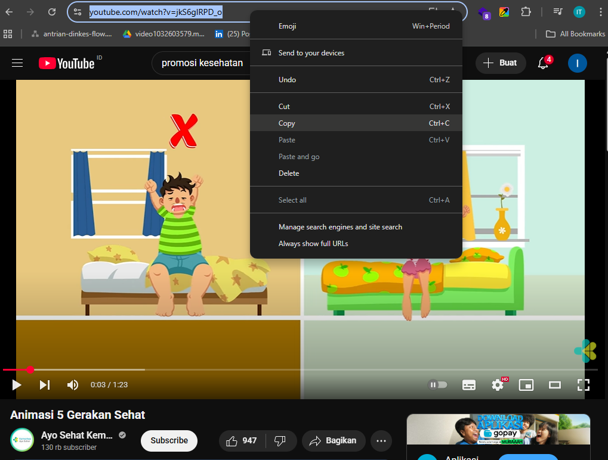

Gambar 2. 26 Menambahkan Video Promosi Kesehatan

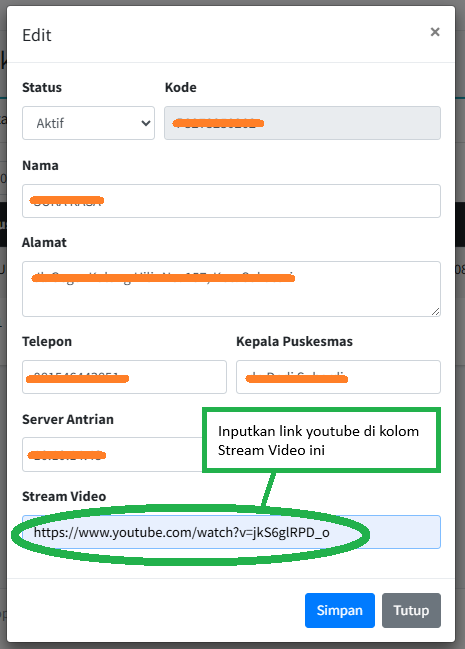

## Setting Audio dan Display Pemanggilan

> Setelah disesuaikan IP Address dan Stream video nya, selanjutnya diperlukan untuk set audio dan display aplikasi antrian, untuk set audio dan display bisa memilih sidebar menu Audio dan Display, bisa juga menyesuaikan sumber suara speaker.

Jika puskesmas mempunya satu lantai, bisa menggunakan satu sumber audio speaker saja, tetapi kalau puskesmas mempunyai lebih dari satu lantai dan ingin di perdengarkan juga bisa di set juga audio dan speakernya di lantai yang lainnya, semua audio sudah terintegrasi jadi satu sehingga tidak akan duplikasi suara atau saling bersahutan.

Set audio dan display tidak hanya ada di akun admin puskesmas, tetapi juga tersedia di akun loket, anjungan ataupun di pendaftaran.

Gambar 2. 27 Menu Set Audio dan Display Aplikasi Antrian Online

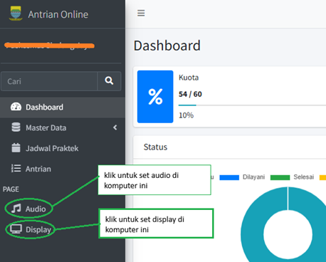

Gambar 2. 28 Set Audio Aplikasi Antrian Berjalan

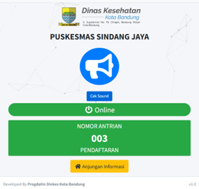

Gambar 2. 29 Set Display Aplikasi Antrian Berjalan

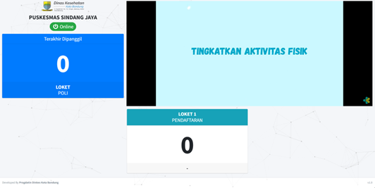
