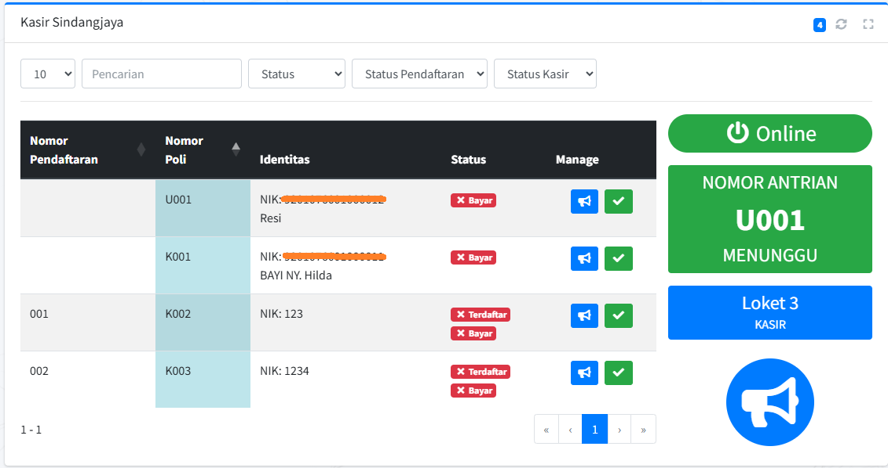
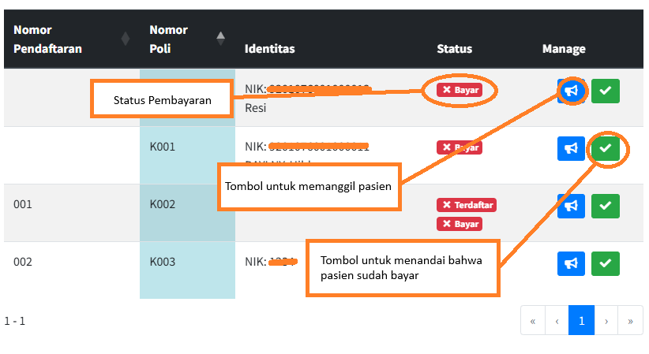

# PENGGUNAAN UNTUK PETUGAS KASIR

Sebagai petugas kasir, Anda memulai tugas dengan melakukan login ke akun kasir pada aplikasi antrian puskesmas untuk mengakses halaman kasir. Setelah masuk, sistem akan menampilkan daftar pasien yang telah dirujuk dari pendaftaran atau poli bagi yang terlewat pembayaran untuk melakukan pembayaran; untuk memanggil pasien, klik tombol \"Panggil Antrian Kasir\" yang akan menampilkan nomor dan nama pasien pada monitor tunggu serta mengaktifkan panggilan suara. Setelah pasien datang ke loket, lakukan proses pembayaran untuk pasien umum, lalu klik tombol  'Sudah Bayar' untuk menandai bahwa pasien sudah membayar dan lunas, selanjutnya pasien umum diarahkan untuk menuju ke poli untuk menunggu pelayanan kesehatan.

## Login ke Akun Kasir

Langkah-langkah:

1)  Buka aplikasi melalui browser.

2)  Masukkan Username dan Password akun kasir.

Gambar 5. 1 Login akun Kasir

3)  Klik tombol \"Login\".

Setelah berhasil, Anda akan masuk ke halaman kasir.

Gambar 5. 2 Halaman Kasir

## Memanggil Antrian Pasien untuk Pembayaran

Untuk memanggil pasien bisa klik tombol  "Panggil Antrian" maka akan muncul audio pemanggilan antrian.

Gambar 5. 3 Tampilan Tombol Panggil Pasien Kasir, Sudah Bayar, dan Status Pembayaran

## Proses Pembayaran (Pasien Umum)

Jika pasien sudah bayar maka petugas kasir menandai bahwa pasien sudah membayar dengan klik tombol  "Sudah Bayar" seperti gambar diatas, maka pasien yang sudah bayar akan otomatis hilang dan tersisi pasien lain yang belum bayar.
