# PENGGUNAAN UNTUK PASIEN

Untuk menggunakan aplikasi antrian puskesmas, pasien cukup mendatangi Anjungan Mandiri yang tersedia di lokasi puskesmas, lalu pada layar sentuh tersedia opsi untuk memilih jenis layanan yang dibutuhkan---apakah sebagai pasien baru atau pasien lama---serta tujuan poli atau layanan tertentu; setelah memilih, nomor antrian akan tercetak secara otomatis, dan pasien hanya perlu menunggu di area tunggu yang telah disediakan hingga nomor antrian mereka dipanggil melalui monitor atau pengeras suara untuk menuju ke loket pendaftaran, poli atau kasir sesuai dengan urutan.

## Menggunakan Anjungan Mandiri

Aplikasi Antrian bisa diakses menggunakan browser, jika sudah di akses dan login ke akun anjungan kemudian pilih Anjungan Mandiri, maka Anjungan sudah siap digunakan oleh Pasien secara mandiri mendaftar dan mengambil tiket antrian.

Gambar 3. 1 Tampilan Anjungan Mandiri untuk Cetak Antrian Pasien

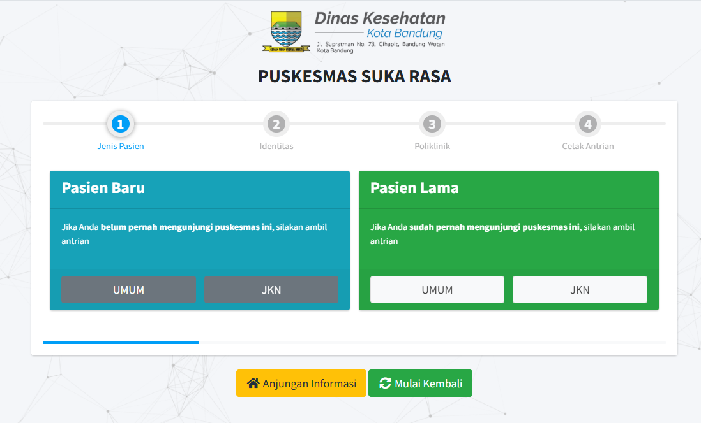

### Cetak Antrian Pasien Baru

Pasien Baru adalah pasien yang belum pernah melakukan pelayanan kesehatan di puskesmas dan pasti data pasien belum ada di database SIKDA, ketika akan cetak antrian pasien diberikan dua pilihan yaitu pasien umum dan pasien jkn, setelah memilih jenis pasien maka pasien harus menginputkan NIK pasien di inputan anjungan, kemudian pasien memilih layanan yang tersedia atau pilih poliklinik yang tersedia, setelah itu pasien bisa mencetak tiket antrian yang akan keluar tiket nya di mesin anjungan.

Gambar 3. 2 Cetak Tiket Antrian Pasien Baru Umum & JKN/BPJS

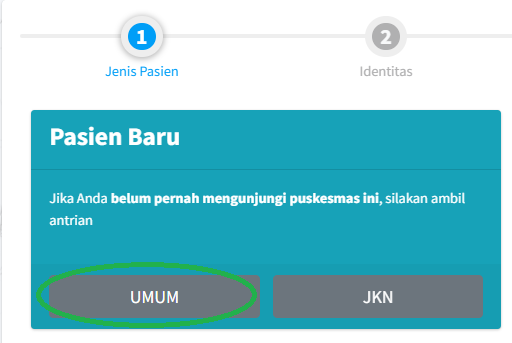

Gambar 3. 3 Cetak Tiket Antrian Pasien Baru Umum Masukan NIK

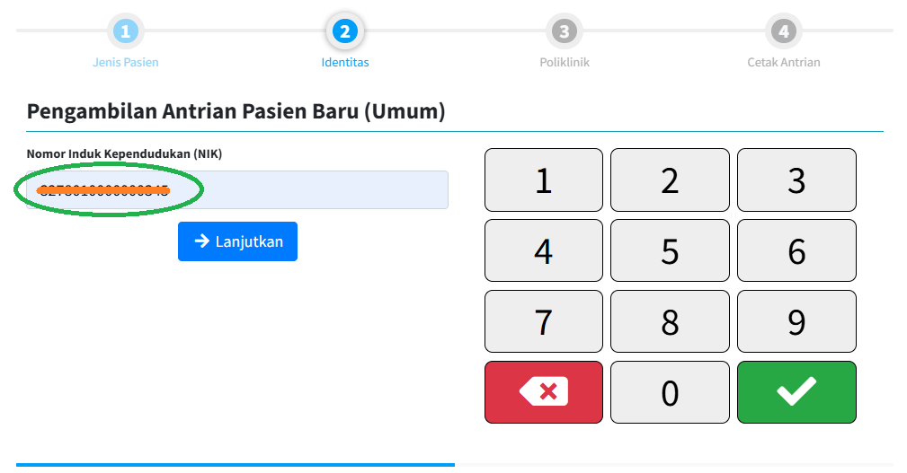

Gambar 3. 4 Cetak Tiket Antrian Pasien Baru JKN/BPJS Masukan NIK

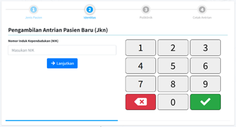

Gambar 3. 5 Cetak Tiket Antrian Pasien Baru Umum/JKN/BPJS Pilih Poli

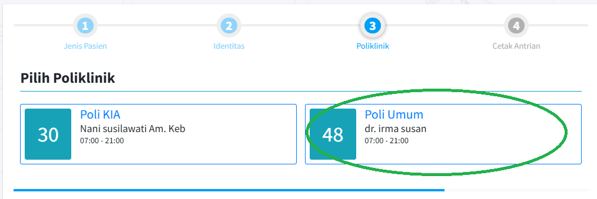

Gambar 3. 6 Cetak Antrian Pasien Baru Umum Cetak Tiket

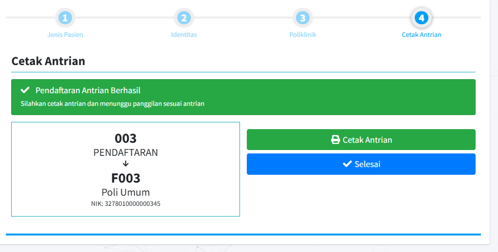

Gambar 3. 7 Tampilan Tiket Antrian Pasien Baru Umum

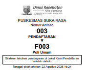

Gambar 3. 8 Tampilan Tiket Antrian Pasien Baru JKN/BPJS

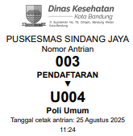

Setelah Pasien Baru Cetak tiket antrian maka pasien bisa langsung menuju pendaftaran untuk menunggu antrian Pendaftaran yang akan didaftarkan dan dimasukan datanya ke SIKDA dan selanjutnya jika pasien umum lanjut ke Kasir untuk pembayaran pelayanan, dan jika pasien JKN bisa langsung menuju Poli untuk menunggu antrian Poli.

### Cetak Antrian Pasien Lama

Pasien lama adalah pasien yang sudah pernah berkunjung dan berobat ke puskesmas yang datanya sudah ada di database SIKDA, ketika akan cetak antrian pasien lama diberikan pilihan yaitu jenis kategor Umum atau JKN, jika pasien adalah Umum maka pasien diarahkan ke kasir untuk membayar biaya pelayanan, jika pasien JKN maka pasien bisa langsung menuju Poli sesuai yang dituju dan menunggu antrian Poli untuk di panggil untuk dilakukan Pelayanan Kesehatan.

Gambar 3. 9 Cetak Antrian Pasien Lama

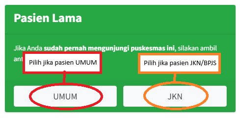

Gambar 3. 10 Cetak Antrian Pasien Lama Input Data NIK/RM Pasien Umum

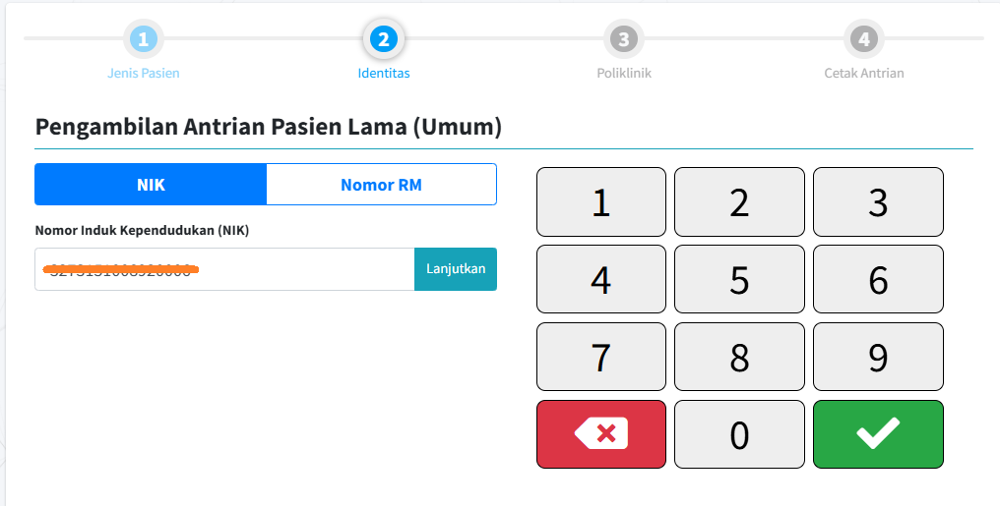

Gambar 3. 11 Cetak Antrian Pasien Lama Input Data NIK/RM/No. BPJS Pasien JKN/BPJS

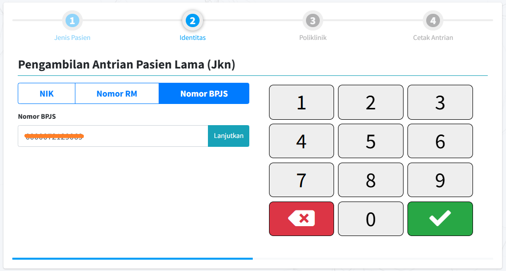

Gambar 3. 12 Cetak Antrian Pasien Lama Verifikasi Data Pasien Umum

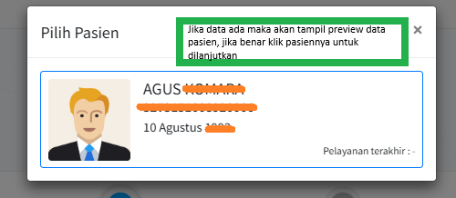

Gambar 3. 13 Cetak Antrian Pasien Lama Verifikasi Data Pasien JIKN/BPJS

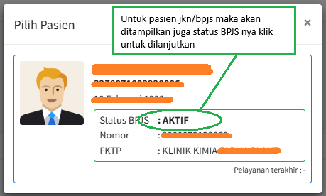

Gambar 3. 14 Cetak Antrian Pasien Lama Pilih Poli

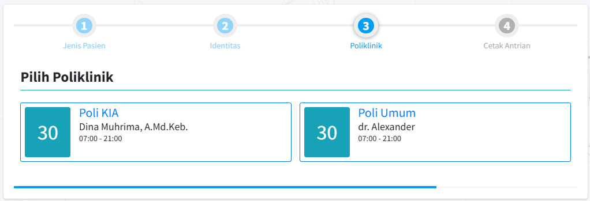

Gambar 3. 15 Cetak Antrian Pasien Lama sudah dapat nomor antrian

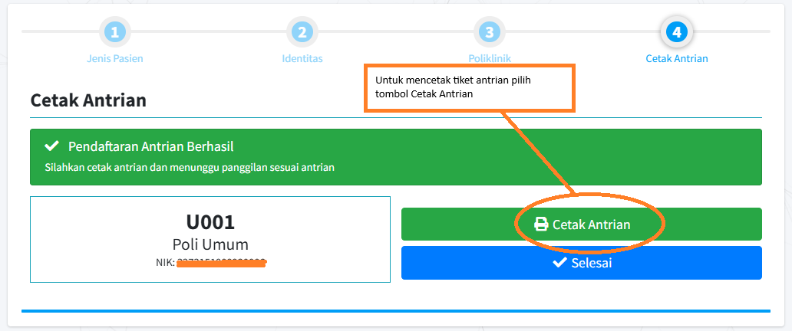

Gambar 3. 16 Tampilan Tiket Antrian Pasien Lama Umum

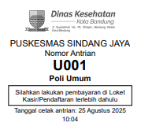

Gambar 3. 17 Tampilan Tiket Antrian Pasien Lama JIKN/BPJS

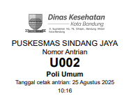
