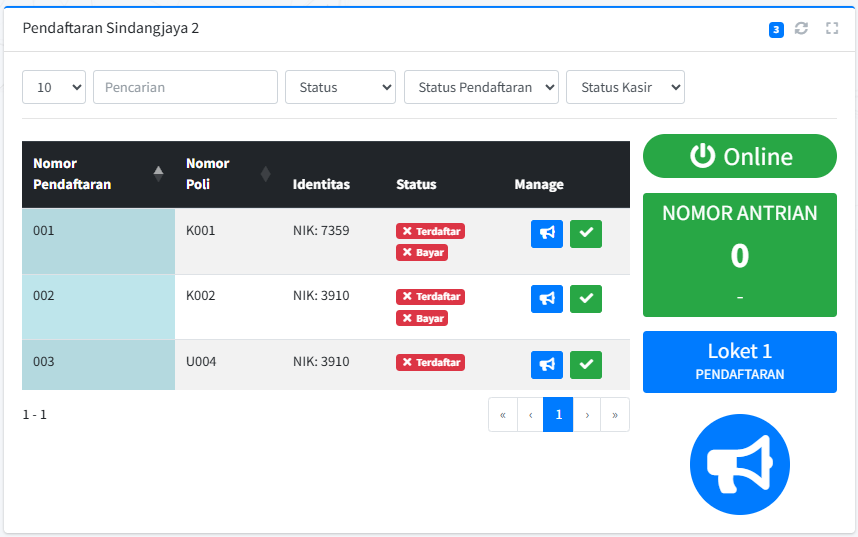
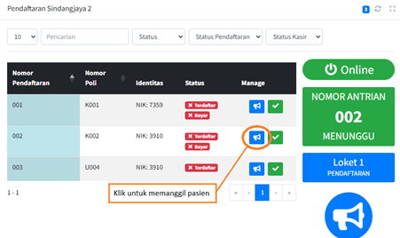
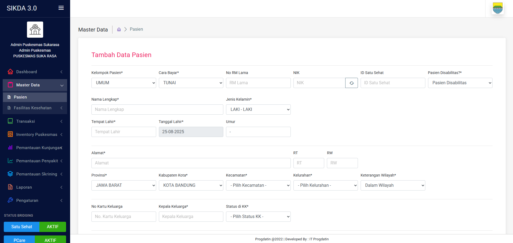
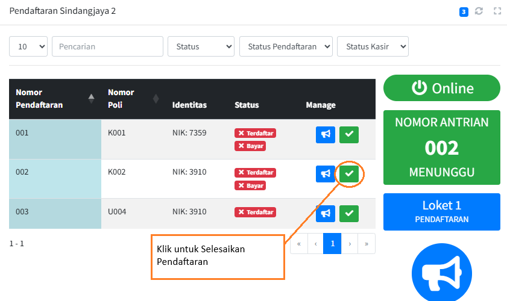
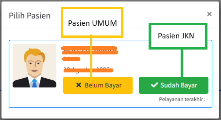

# PENGGUNAAN UNTUK PETUGAS PENDAFTARAN

Sebagai petugas pendaftaran, Anda akan mengawali sesi kerja dengan melakukan login ke dalam sistem aplikasi antrian menggunakan akun khusus yang telah diberikan, kemudian pada antarmuka utama Anda dapat melihat daftar antrian pasien yang telah mengambil nomor melalui anjungan mandiri; untuk memanggil pasien berikutnya, cukup klik tombol  \"Panggil Antrian\" pada layar yang akan mengupdate nomor yang sedang dilayani secara real-time di monitor tunggu dan mengirim suara panggilan, lalu saat pasien telah berada di loket, lakukan proses pendaftaran dengan memasukkan data pasien ke dalam sistem SIKDA untuk pasien baru, dan setelah selesai klik tombol "Selesai Pendaftaran", secara sistem akan mengecek kesesuaian dengan database SIKDA jika sudah sama maka status terdaftar akan berubah menjadi hijau, dan pasien akan dilanjutkan ke alur selanjutnya (JKN langsung ke Poli, Umum langsung ke Kasir).

## Login ke akun pendaftaran

Langkah-langkah:

1)  Buka aplikasi melalui browser.

2)  Masukkan Username dan Password akun pendaftaran.

Gambar 2. 30 Login akun Pendaftaran

1)  Klik tombol \"Login\".

Setelah berhasil, Anda akan masuk ke halaman pendaftaran.

Gambar 4. 1 Halaman Loket Pendaftaran

## Memanggil antrian pasien baru

Langkah-langkah:

1)  Klik tombol Panggil Antrian
     untuk memanggil pasien.

Gambar 4. 2 Tombol untuk memanggil Pasien

2)  Setelah pasien datang ke pendaftaran dilanjutkan dengan proses
    pendaftaran pasien di SIKDA.

## Proses Pendaftaran pasien di SIKDA

Daftarkan pasien baru di sistem SIKDA, prosesnya sama dengan yang sekarang biasa dilakukan di puskesmas.

Gambar 4. 3 Proses Pendaftaran Pasien Baru di SIKDA

## Selesaikan / Validasi Proses Pendaftaran

Langkah-langkahnya:

1)  Setelah selasai mendaftarakan di SIKDA, selanjutnya di aplikasi
    antrian di halaman pendaftaran klik tombol
     "Selesai Pendaftaran", maka sistem
    akan mengecek apakah data identitas sudah ada di database SIKDA,
    jika ada maka akan menmpilkan konfirmasi pembayaran.

Gambar 4. 4 Tombol Selesaikan Pendaftaran

2)  Konfirmasikan Pembayaran, jika pasien JKN/BPJS silahkan untuk klik
    , jika pasien umum silahkan untuk
    klik .

Gambar 4. 5 Konfirmasi Pembayaran Pasien

3)  Jika sudah dikonfirmasi pembayarannya maka data pasien yang tadinya
    ada di data antrian akan otomatis hilang dan diarahkan pasiennya ke
    kasir jika pasien umum, jika pasien baru diarahkan ke poli, sesuai
    flow di Gambar 1.2 Flow Diagram Aplikasi.
