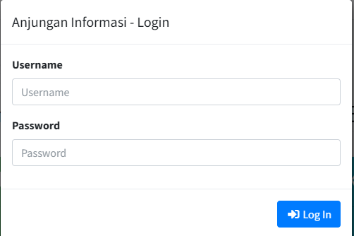
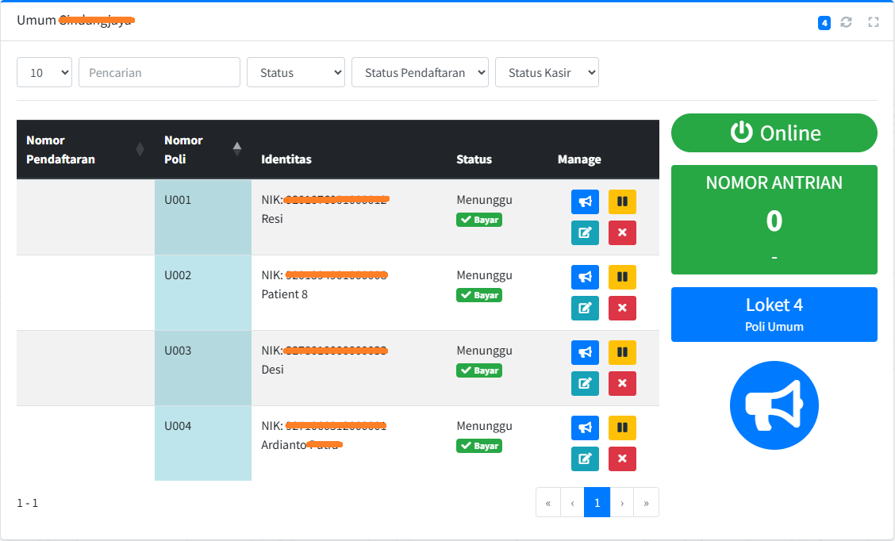
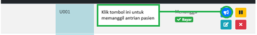
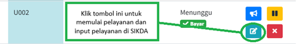
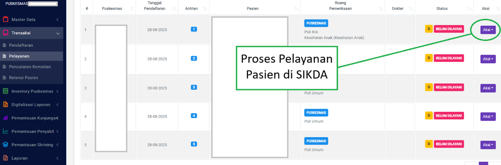
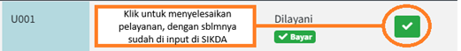
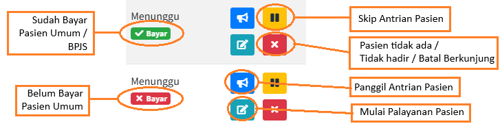

# PENGGUNAAN UNTUK PETUGAS POLI

## Login ke Poli

Langkah-langkah:

1)  Buka aplikasi melalui browser.

2)  Masukkan Username dan Password akun loket poli.

Gambar 6. 1 Login akun loket poli

1)  Klik tombol \"Login\".

Setelah berhasil, Anda akan masuk ke halaman Poli.

Gambar 6. 2 Tampilan Halaman Poli

## Memanggil antrian poli

Untuk memanggil antrian Poli tekan tombol "Panggil Antrian".

Gambar 6. 3 Panggil Antrian Poli

## Input Pelayanan Kesehatan di SIKDA

Setelah pasien di panggil maka klik tombol  "Dilayani" untuk dilanjutkan dengan proses Input pelayanan pasien di SIKDA.

Gambar 6. 4 Memulai Pelayanan Poli

Gambar 6. 5 Proses Pelayanan Pasien di SIKDA

Gambar 6. 6 Selesaikan Pelayanan Poli

## Keterangan Tambahan Pelayanan

Pemanggilan di rekomendasikan sesuai dengan urutan antrian nomor poli dan yang sudah membayar, jika ada keterangan status nya belum bayar maka tidak di prioritaskan untuk di panggil, karena bisa jadi belum selesai pembayaran di kasir sebagai pasien umum.

Gambar 6. 7 Keterangan icon tambahan di Pelayanan

